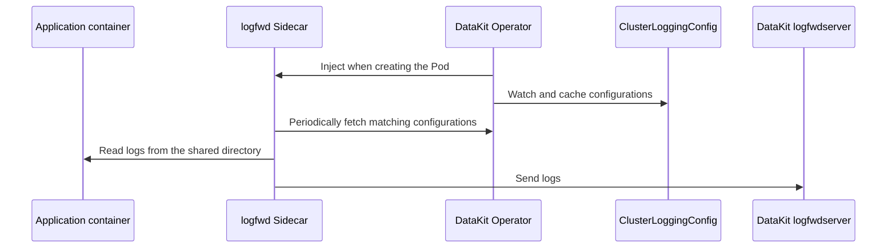

# Injecting logfwd with DataKit Operator

logfwd collects file logs that are not written to container standard output. DataKit Operator injects a `datakit-logfwd` Sidecar into the target Pod and shares the application container's log directories with the Sidecar. The Sidecar then sends the logs to DataKit `logfwdserver`.

Starting with v1.7.0, using the `ClusterLoggingConfig` CRD to manage collection configurations centrally is recommended. By default, the Sidecar fetches the latest configuration from the Operator every 60 seconds, so application Pods do not need to be recreated when collection rules change.



## Prerequisites {#prerequisites}

- DataKit has enabled `logfwdserver`, which listens on port `9533` by default.
- The DataKit Service exposes `9533`, and application Pods can access DataKit.
- For dynamic configuration, the `logging.datakits.io/v1alpha1 ClusterLoggingConfig` CRD is installed in the cluster and the Operator ServiceAccount has `get`, `list`, and `watch` permissions.
- The logfwd Sidecar must be able to access the application log directories. These directories should use a shared EmptyDir, or the Operator should create and mount them based on `log_volume_paths`.

For the legacy method, see [logfwd injection in v1.6.0 and earlier](operator-v1.6.0-logfwd.md).

## Operator Configuration {#datakit-operator-inject-logfwd-instructions}

Add a rule to `admission_inject_v2.logfwds`:

```json
{
    "admission_inject_v2": {
        "logfwds": [
            {
                "name": "logfwd-app",
                "namespace_selectors": ["^middleware$"],
                "label_selectors": ["app=logging"],
                "check_annotation": false,
                "image": "{{.LogfwdImage}}",
                "envs": {
                    "LOGFWD_DATAKIT_HOST": "{fieldRef:status.hostIP}",
                    "LOGFWD_DATAKIT_PORT": "9533",
                    "LOGFWD_DATAKIT_OPERATOR_ENDPOINT": "datakit-operator.datakit.svc:443",
                    "LOGFWD_GLOBAL_SERVICE": "{fieldRef:metadata.labels['app']}",
                    "LOGFWD_POD_NAME": "{fieldRef:metadata.name}",
                    "LOGFWD_POD_NAMESPACE": "{fieldRef:metadata.namespace}",
                    "LOGFWD_POD_IP": "{fieldRef:status.podIP}"
                },
                "log_configs": "",
                "log_volume_paths": ["/var/log/app"],
                "resources": {
                    "requests": {
                        "cpu": "100m",
                        "memory": "128Mi"
                    },
                    "limits": {
                        "cpu": "200m",
                        "memory": "256Mi"
                    }
                }
            }
        ]
    }
}
```

Common fields:

| Field | Description |
| --- | --- |
| `name` | Rule name, recommended for locating relevant logs |
| `namespace_selectors` | Array of Namespace regular expressions |
| `label_selectors` | Array of Pod Label Selectors |
| `check_annotation` | Legacy compatibility switch; when `true`, `admission.datakit/logfwd.instances` is also required |
| `image` | logfwd Sidecar image |
| `envs` | Sidecar environment variables |
| `log_configs` | Optional static log configuration JSON string |
| `log_volume_paths` | Log directories shared between application containers and the Sidecar |
| `resources` | Sidecar resource configuration; defaults are used when missing or invalid |

For the general rules governing selectors and Annotations, see [DataKit Operator injection rules](datakit-operator.md#datakit-operator-inject). logfwd uses the first matching rule.

### Environment Variables {#envs}

| Environment variable | Description |
| --- | --- |
| `LOGFWD_DATAKIT_HOST` | DataKit address, usually the node IP |
| `LOGFWD_DATAKIT_PORT` | DataKit `logfwdserver` port; defaults to `9533` |
| `LOGFWD_DATAKIT_OPERATOR_ENDPOINT` | Operator address for dynamically fetching CRD configurations; `https://` is used automatically when the protocol is omitted |
| `LOGFWD_GLOBAL_SOURCE` | Overrides `source` in all log configurations |
| `LOGFWD_GLOBAL_SERVICE` | Global value used when an individual configuration has no `service` |
| `LOGFWD_GLOBAL_STORAGE_INDEX` | Overrides `storage_index` in all log configurations |
| `LOGFWD_GLOBAL_FROM_BEGINNING_THRESHOLD_SIZE` | Global threshold for collecting from the beginning of a file, in bytes |
| `LOGFWD_POD_NAME` | Written to the `pod_name` tag |
| `LOGFWD_POD_NAMESPACE` | Written to the `namespace` tag |
| `LOGFWD_POD_IP` | Written to the `pod_ip` tag |

### Configuration Sources {#log-configs}

logfwd supports three configuration sources:

1. Recommended: use `LOGFWD_DATAKIT_OPERATOR_ENDPOINT` to dynamically fetch `ClusterLoggingConfig`.
1. Configure static tasks in the rule's `log_configs`.
1. Legacy compatibility: configure through the `admission.datakit/logfwd.instances` Annotation.

`log_configs` can be empty. As long as the rule matches, the Operator still injects the Sidecar so it can fetch CRD configurations over the network. If none of the three sources provides a valid configuration, the Sidecar is injected but has no log collection tasks.

Example static `log_configs`:

```json
[
    {
        "type": "file",
        "source": "app",
        "service": "checkout",
        "path": "/var/log/app/*.log",
        "multiline_match": "^\\d{4}-\\d{2}-\\d{2}",
        "from_beginning": false,
        "tags": {
            "env": "production"
        }
    }
]
```

Write this array as a JSON string in `log_configs` in the Operator configuration. Common fields include `type`, `source`, `path`, `service`, `pipeline`, `storage_index`, `multiline_match`, `from_beginning`, `from_beginning_threshold_size`, `character_encoding`, and `tags`.

### Log Directories {#volume-paths}

`log_volume_paths` specifies the directories that the Sidecar must read. For example:

```json
{
    "log_volume_paths": ["/var/log/app", "/data/log"]
}
```

- If an application container already mounts an EmptyDir at the path, the Operator mounts the same volume read-only in the Sidecar.
- If the path has no corresponding mount, the Operator creates an EmptyDir and mounts it in all regular application containers and the Sidecar.
- If the same path uses a volume other than EmptyDir, the Operator logs a conflict and skips the path.
- Avoid configuring both a parent directory and its child directory, which can cause mount conflicts.

The dynamic CRD can update collection tasks but cannot modify volumes in an existing Pod. Before adding a file path to the CRD, ensure that its directory is already shared with the Sidecar through `log_volume_paths` or the application Pod's own EmptyDir.

## ClusterLoggingConfig {#crd-config}

The following resource matches Pods in the `middleware` Namespace with the `app=logging` label:

```yaml
apiVersion: logging.datakits.io/v1alpha1
kind: ClusterLoggingConfig
metadata:
  name: app-logs
spec:
  selector:
    namespaceRegex: "^middleware$"
    podLabelSelector: "app=logging"
  podTargetLabels:
    - app
    - env
  configs:
    - type: file
      source: app
      service: checkout
      path: /var/log/app/*.log
      multiline_match: "^\\d{4}-\\d{2}-\\d{2}"
      tags:
        team: checkout
```

The Operator repository does not install this CRD. For all fields and CRD installation instructions, see [Kubernetes container log CRD configuration](../integrations/container-log-for-k8s-crd.md).

## Deployment Example {#inject-logfwd-example}

```yaml
apiVersion: apps/v1
kind: Deployment
metadata:
  name: logging-demo
  namespace: middleware
spec:
  replicas: 1
  selector:
    matchLabels:
      app: logging
  template:
    metadata:
      labels:
        app: logging
      annotations:
        admission.datakit/logfwd.enabled: "true"
    spec:
      containers:
        - name: app
          image: nginx:1.25
          volumeMounts:
            - name: app-logs
              mountPath: /var/log/app
      volumes:
        - name: app-logs
          emptyDir: {}
```

After creation, check:

```shell
kubectl -n middleware get pod -l app=logging
kubectl -n middleware get pod -l app=logging -o yaml
kubectl logs -n datakit deployment/datakit-operator
```

The Pod should contain the `datakit-logfwd` Sidecar and share `/var/log/app`. If no logs are collected, also check DataKit port `9533`, `LOGFWD_DATAKIT_OPERATOR_ENDPOINT`, the `ClusterLoggingConfig` match result, and the Sidecar logs.
