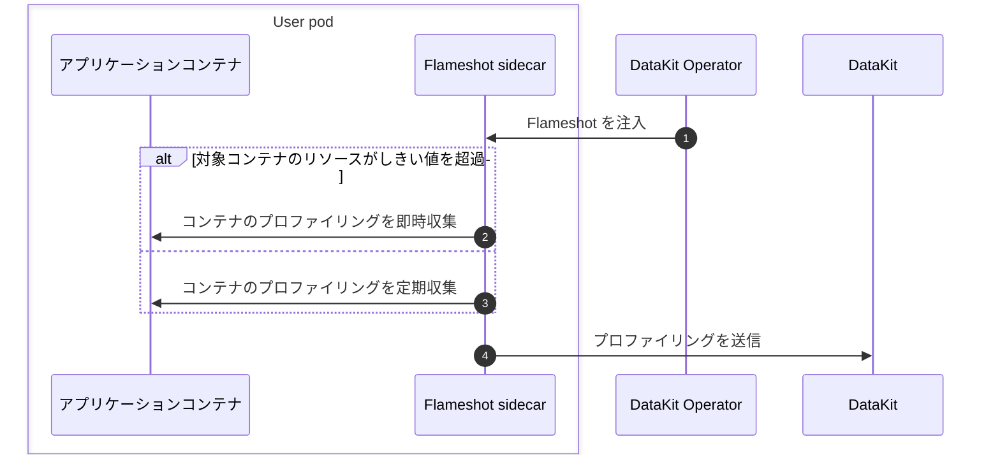

# DataKit Operator による Flameshot の注入

[:octicons-tag-24: Operator Version-1.8.0](operator-changelog.md#cl-1.8.0)

---

Flameshot は、従来の Profiler（async-profiler、py-spy など）に代わるものとして DataKit-Operator に導入されたパフォーマンス分析ツールです。



## 前提条件 {#flameshot-prerequisites}

- クラスターに [DataKit](https://docs.<<<custom_key.brand_main_domain>>>/datakit/datakit-daemonset-deploy/){:target="_blank"} がインストール済みであること。
- [profile](https://docs.<<<custom_key.brand_main_domain>>>/datakit/datakit-daemonset-deploy/#using-k8-env){:target="_blank"} コレクターを有効にします。
- （任意）Prometheus Annotations の自動注入機能を使用する場合は、DataKit の KubernetesPrometheus コレクターを有効にし、`EnableDiscoveryOfPrometheusPodAnnotations = true` を設定して Pod Annotations の自動検出機能を有効にする必要があります。

## 使用方法 {#flameshot-usage}

1. 対象の Kubernetes クラスターに、[DataKit-Operator をダウンロードしてインストールします](datakit-operator.md#install)
1. DataKit Operator の設定で `flameshots` 配列を設定し、`namespace_selectors`/`label_selectors` のマッチングルールと `processes` フィールドで監視対象のプロセスを指定します。
1. （任意）Deployment に指定の Annotation `admission.datakit/flameshot.enabled: "true"` を追加して Flameshot の注入を許可します（`"false"` に設定すると注入が無効になります）。

Flameshot の設定例：

```json
{
    "admission_inject_v2": {
        "flameshots": [
            {
                "namespace_selectors": [],
                "label_selectors":     [],
                "image": "{{.FlameshotImage}}",
                "envs": {
                    "FLAMESHOT_DATAKIT_ADDR":     "http://datakit-service.datakit:9529/profiling/v1/input",
                    "FLAMESHOT_MONITOR_INTERVAL": "10s",
                    "FLAMESHOT_LOG_LEVEL":        "info",
                    "FLAMESHOT_PROFILING_PATH":   "/flameshot-data",
                    "FLAMESHOT_LOG_PATH":         "/var/log/flameshot.log",
                    "FLAMESHOT_PROFILING_ENABLED": "true",
                    "FLAMESHOT_AUTO_PROFILING":   "10m",
                    "FLAMESHOT_AUTO_PROFILING_DURATION": "15s",
                    "FLAMESHOT_OOM_HPROF_ENABLED": "true",
                    "FLAMESHOT_OOM_HPROF_MATCH_WINDOW": "3m",
                    "FLAMESHOT_HPROF_UPLOAD_ENABLED": "true",
                    "FLAMESHOT_HPROF_UPLOAD_PROVIDER": "oss",
                    "FLAMESHOT_HPROF_UPLOAD_AUTH_TYPE": "static",
                    "FLAMESHOT_HPROF_UPLOAD_ENDPOINT": "https://oss-cn-hangzhou.aliyuncs.com",
                    "FLAMESHOT_HPROF_UPLOAD_REGION": "cn-hangzhou",
                    "FLAMESHOT_HPROF_UPLOAD_BUCKET": "heap-dumps",
                    "FLAMESHOT_HPROF_UPLOAD_ACCESS_KEY_ID": "<access-key-id>",
                    "FLAMESHOT_HPROF_UPLOAD_ACCESS_KEY_SECRET": "<access-key-secret>",
                    "FLAMESHOT_HPROF_UPLOAD_SECURITY_TOKEN": "<sts-security-token>",
                    "FLAMESHOT_HEAP_DUMP_ENABLED": "true",
                    "FLAMESHOT_POD_MEM_LIMIT": "2048",
                    "FLAMESHOT_HTTP_LOCAL_IP":    "{fieldRef:status.podIP}",
                    "FLAMESHOT_HTTP_LOCAL_PORT":  "8089",
                    "FLAMESHOT_SERVICE":  "{fieldRef:metadata.labels['app']}",
                    "FLAMESHOT_TAGS": "pod_name:$(POD_NAME),pod_namespace:$(POD_NAMESPACE),host:$(NODE_NAME)"
                },
                "resources": {
                    "requests": {
                        "cpu":    "100m",
                        "memory": "128Mi"
                    },
                    "limits": {
                        "cpu":    "200m",
                        "memory": "256Mi"
                    }
                },
                "processes": "",
                "enable_prometheus_annotations": true
            }
        ]
    }
}
```

設定フィールドの説明：

| フィールド                            | 型    | 必須     | 説明                                                                                                  |
| ------                          | ------  | ------   | ------                                                                                                |
| `namespace_selectors`           | array   | いいえ       | Namespace セレクターの配列です。正規表現によるマッチングをサポートします                                                                |
| `label_selectors`               | array   | いいえ       | ラベルセレクターの配列です。Kubernetes Label Selector 構文を使用します                                                  |
| `image`                         | string  | はい       | Flameshot コンテナイメージのアドレス                                                                                |
| `envs`                          | object  | いいえ       | 環境変数設定です。Downward API をサポートします                                                                       |
| `resources`                     | object  | いいえ       | リソース制限設定（requests および limits）                                                                   |
| `processes`                     | string  | はい       | プロセス監視設定（JSON 文字列）です。`FLAMESHOT_PROCESSES` 環境変数として Flameshot コンテナに注入されます。形式については [Flameshot 関連ドキュメント](../integrations/flameshot.md) を参照してください |
| `enable_prometheus_annotations` | boolean | いいえ       | Prometheus 関連の Annotations を自動的に追加するかどうかを指定します。デフォルト設定テンプレートでは `true` です。ユーザーが設定をカスタマイズし、このフィールドを設定しない場合、デフォルトは `false` です。Pod に `prometheus.io/` で始まる Annotation がすでに存在する場合は注入されません |

<!-- markdownlint-disable MD046 -->
???+ important

    **重要事項**：`processes` フィールドは JSON 文字列です。この値は `FLAMESHOT_PROCESSES` 環境変数として Flameshot コンテナに直接注入されます。`processes` フィールドの形式と意味については、[Flameshot 関連ドキュメント](../integrations/flameshot.md) を参照してください。`processes` が空の場合、Flameshot の注入はスキップされます。
<!-- markdownlint-enable MD046 -->

### 環境変数 {#envs}

| 環境変数名                   | 説明                                                                                      |
| :---                         | :---                                                                                      |
| `FLAMESHOT_DATAKIT_ADDR`     | DataKit のプロファイリング受信アドレス。例：`http://datakit-service.datakit:9529/profiling/v1/input` |
| `FLAMESHOT_MONITOR_INTERVAL` | 監視間隔。例：`10s`                                                                      |
| `FLAMESHOT_LOG_LEVEL`        | ログレベル。例：`info`                                                                     |
| `FLAMESHOT_PROFILING_PATH`   | プロファイリングデータの保存パス。例：`/flameshot-data`                                            |
| `FLAMESHOT_LOG_PATH`         | ログファイルのパス。例：`/var/log/flameshot.log`                                               |
| `FLAMESHOT_PROFILING_ENABLED` | JFR プロファイリングを有効にするかどうか。例：`true`                                                     |
| `FLAMESHOT_AUTO_PROFILING`   | 定期収集の間隔。例：`10m`                                                                  |
| `FLAMESHOT_AUTO_PROFILING_DURATION` | 1 回の定期収集の継続時間。例：`15s`                                                        |
| `FLAMESHOT_OOM_HPROF_ENABLED` | OOM `.hprof` サマリーの復元を有効にするかどうか。例：`true`                                            |
| `FLAMESHOT_OOM_HPROF_MATCH_WINDOW` | OOM イベントと `.hprof` のマッチングウィンドウ。例：`3m`                                          |
| `FLAMESHOT_HPROF_UPLOAD_ENABLED` | hprof のオブジェクトストレージへのアップロードを有効にするかどうか。例：`true`                                            |
| `FLAMESHOT_HPROF_UPLOAD_PROVIDER` | オブジェクトストレージのタイプ。`oss` および `s3` をサポートします                                                    |
| `FLAMESHOT_HPROF_UPLOAD_AUTH_TYPE` | hprof アップロードの認証タイプ。`static` は AK/SK を直接使用し、STS SecurityToken を任意で指定できます。`assume_role` は元の AK/SK を使用して Alibaba Cloud STS AssumeRole を呼び出し、一時認証情報を取得して更新します。`assume_role` は OSS のみをサポートし、Flameshot 0.2.4 以降が必要です。 |
| `FLAMESHOT_HPROF_UPLOAD_ENDPOINT` | OSS/S3 endpoint                                                                      |
| `FLAMESHOT_HPROF_UPLOAD_REGION` | OSS/S3 region。例：`cn-hangzhou` または `us-east-1`                                   |
| `FLAMESHOT_HPROF_UPLOAD_BUCKET` | 対象 bucket                                                                          |
| `FLAMESHOT_HPROF_UPLOAD_ACCESS_KEY_ID` | オブジェクトストレージの AK                                                                    |
| `FLAMESHOT_HPROF_UPLOAD_ACCESS_KEY_SECRET` | オブジェクトストレージの SK                                                                |
| `FLAMESHOT_HPROF_UPLOAD_SECURITY_TOKEN` | 任意の Alibaba Cloud OSS STS SecurityToken。一時 AK/SK と同時に設定すると STS 認証が使用されます。Flameshot 0.2.3 以降が必要で、認証情報の有効期限が切れる前に Pod を再作成する必要があります。 |
| `FLAMESHOT_HPROF_UPLOAD_ASSUME_ROLE_ARN` | `assume_role` 認証モードでは必須です。対象の RAM Role ARN。 |
| `FLAMESHOT_HPROF_UPLOAD_ASSUME_ROLE_SOURCE_ACCESS_KEY_ID` | `assume_role` 認証モードでは必須です。STS AssumeRole の呼び出しに使用する元の ID の AK。最小限の `sts:AssumeRole` 権限のみを付与することを推奨します。 |
| `FLAMESHOT_HPROF_UPLOAD_ASSUME_ROLE_SOURCE_ACCESS_KEY_SECRET` | `assume_role` 認証モードでは必須です。STS AssumeRole の呼び出しに使用する元の ID の SK。 |
| `FLAMESHOT_HPROF_UPLOAD_ASSUME_ROLE_SOURCE_SECURITY_TOKEN` | 任意。元の ID 自体が一時認証情報である場合は、元の ID の SecurityToken を設定できます。 |
| `FLAMESHOT_HPROF_UPLOAD_ASSUME_ROLE_SESSION_NAME` | 任意。AssumeRole のロールセッション名。 |
| `FLAMESHOT_HPROF_UPLOAD_ASSUME_ROLE_DURATION_SECONDS` | 任意。AssumeRole が返す STS 認証情報の有効期間です。単位は秒、デフォルトは `3600`、最小値は `900` です。 |
| `FLAMESHOT_HPROF_UPLOAD_ASSUME_ROLE_POLICY` | 任意の inline policy。返される STS 認証情報の権限をさらに制限するために使用します。 |
| `FLAMESHOT_HPROF_UPLOAD_ASSUME_ROLE_EXTERNAL_ID` | 任意の ExternalId。アカウント間または confused deputy のユースケースで使用します。 |
| `FLAMESHOT_HPROF_UPLOAD_ASSUME_ROLE_STS_ENDPOINT` | 任意の STS endpoint。例：`sts.cn-hangzhou.aliyuncs.com`。 |
| `FLAMESHOT_HEAP_DUMP_ENABLED` | メモリ緊急しきい値に基づく能動的な Heap Dump を有効にするかどうか。例：`true`                                      |
| `FLAMESHOT_HEAP_DUMP_JMAP_PATH` | `jmap` 実行ファイルのパス。公式 Sidecar イメージにはデフォルトで JVM/JDK が含まれていません。能動的な Heap Dump を有効にする場合は、使用可能な `jmap` を明示的に指定する必要があります |
| `FLAMESHOT_POD_MEM_LIMIT`    | Pod のメモリ limit。単位は Mi。例：`2048`                                                      |
| `FLAMESHOT_HTTP_LOCAL_IP`    | HTTP サービスのローカル IP。通常は Downward API を介して注入します。例：`{fieldRef:status.podIP}`              |
| `FLAMESHOT_HTTP_LOCAL_PORT`  | HTTP サービスのポート。例：`8089`                                                                |
| `FLAMESHOT_PROCESSES`        | プロセス監視設定（`processes` フィールドによって自動的に注入）。JSON 文字列形式です                              |

Flameshot が Alibaba Cloud STS `AssumeRole` を能動的に呼び出して OSS アップロード用の一時認証情報を取得する場合、Operator を変更する必要はありません。既存の `envs` を介して AssumeRole 設定を注入するだけです。元の AK/SK には、`{secretKeyRef:...}` を使用して Kubernetes Secret を参照することを推奨します。Flameshot は、AssumeRole が返す一時認証情報をプロセス内にキャッシュして更新します。STS の呼び出しに失敗した場合や設定が不足している場合、アップロードは失敗し、デフォルトの認証情報チェーン、ノードロール、匿名アップロードにはフォールバックしません。

### Flameshot 自体のライブ収集 {#prom-anno}

`enable_prometheus_annotations` を `true` に設定すると（デフォルト設定テンプレートでは `true`）、DataKit-Operator は Flameshot が注入された Pod に以下の Prometheus 関連 Annotations を自動的に追加します。これにより、Flameshot 自体のメトリクスを収集できます（DataKit の KubernetesPrometheus による収集）。

- `prometheus.io/scrape: "true"`：この Pod が収集対象であることを示します
- `prometheus.io/port: "<port>"`：メトリクス公開ポート。値は環境変数 `FLAMESHOT_HTTP_LOCAL_PORT` から取得します（例：`"8089"`）
- `prometheus.io/scheme: "http"`：メトリクス収集プロトコル
- `prometheus.io/path: "/metrics"`：メトリクスのパス
- `prometheus.io/param_measurement: "flameshot"`：measurement 名を指定します

<!-- markdownlint-disable MD046 -->
???+ warning

    1. Pod に `prometheus.io/` で始まる Annotation が 1 つでも存在する場合、DataKit-Operator は上記の Prometheus Annotations を注入しません。既存のメトリクス収集設定が上書きされるのを防ぐためです
    1. この機能を使用するには、DataKit で KubernetesPrometheus コレクターを有効にし、`EnableDiscoveryOfPrometheusPodAnnotations = true` を設定して Pod Annotations の自動検出機能を有効にする必要があります
<!-- markdownlint-enable MD046 -->

## ユースケース {#flameshot-example}

> **Annotation の使用方法**：`check_annotation` の設定がバージョン Annotation の動作に与える影響、および各 Annotation の詳細については、[Annotation 設定の注入](datakit-operator.md#annotation-injection) および [`check_annotation` 設定項目の説明](datakit-operator.md#check-annotation-config) を参照してください。

<!-- markdownlint-disable MD046 -->
???+ warning

    - `admission.datakit/flameshot.enabled: "true"` Annotation を追加するだけでは注入は実行されません。DataKit-Operator の設定で、一致する `flameshots` ルール（`namespace_selectors`/`label_selectors` および `processes` フィールドを含む）も設定する必要があります
    - `processes` フィールドが空の場合、注入はスキップされます。
<!-- markdownlint-enable MD046 -->

以下は、Deployment によって作成されるすべての Pod に Flameshot を注入する Deployment の例です（DataKit-Operator の設定で一致するルールが設定済みであることが前提です）。

```yaml
apiVersion: apps/v1
kind: Deployment
metadata:
  name: app-deployment
  labels:
    app: myapp
spec:
  replicas: 1
  selector:
    matchLabels:
      app: myapp
  template:
    metadata:
      labels:
        app: myapp
      annotations:
        admission.datakit/flameshot.enabled: "true"
    spec:
      containers:
      - name: app
        image: myapp:latest
        ports:
        - containerPort: 8080
```

yaml ファイルを使用してリソースを作成します：

```shell
$ kubectl apply -f app-deployment.yaml
...
```

次のように確認します：

```shell
$ kubectl get pod

NAME                                   READY   STATUS    RESTARTS      AGE
app-deployment-7bd8dd85f-fzmt2          2/2     Running   0             4s

$ kubectl get pod app-deployment-7bd8dd85f-fzmt2 -o=jsonpath={.spec.containers\[\*\].name}
app datakit-flameshot
```

数分待つと、<<<custom_key.brand_name>>>コンソールの [APM-プロファイリング](https://console.<<<custom_key.brand_main_domain>>>/tracing/profile){:target="_blank"} ページでアプリケーションのパフォーマンスデータを確認できます。

<!-- markdownlint-disable MD046 -->
???+ note

    データを確認できない場合は、`datakit-flameshot` コンテナに入り、対応するログを確認してトラブルシューティングできます：

    ```shell
    $ kubectl exec -it app-deployment-7bd8dd85f-fzmt2 -c datakit-flameshot -- bash
    $ cat /var/log/flameshot.log
    ```
<!-- markdownlint-enable MD046 -->