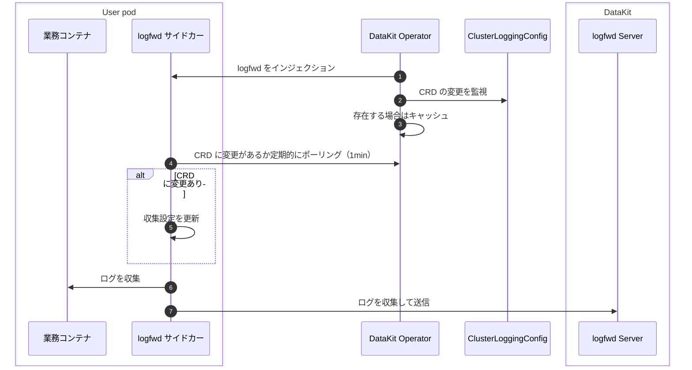

# DataKit Operator による logfwd のインジェクション

Operator による logfwd 収集は、主に Pod 内部のログ（コンテナの stdout に保持されていないログ）を収集します。Pod にサイドカーコンテナをインジェクションし、このサイドカーコンテナがコンテナ内の指定コマンドのログを直接収集して DataKit に送信します。

特定の CRD 設定と組み合わせることで、logfwd 方式では対象 Pod を再起動せずに収集設定を動的に調整できます。




## 前提条件 {#prerequisites}

1. DataKit で `logfwdserver` コレクターを有効にします。デフォルトのリスニングポートは `9533` です
1. DataKit Service で `9533` ポートを公開し、他の Pod から `datakit-service.datakit.svc:9533` にアクセスできるようにする必要があります

## 使用方法 {#datakit-operator-inject-logfwd-instructions}

> Operator <= v1.6.0 では、logfwd インジェクションについて[こちら](operator-v1.6.0-logfwd.md)を参照してください。

`ClusterLoggingConfig` CRD を使用してログ収集設定を一元管理します：[:octicons-tag-24: Version-1.7.0](operator-changelog.md#cl-1.7.0)

- **収集設定の一元管理**：Kubernetes `ClusterLoggingConfig` CRD の監視をサポートし、マッチング結果を公開して logfwd sidecar がポーリングで取得できるようにします（sidecar はデフォルトで 60 秒ごとに Operator へ HTTP リクエストを送信します。logfwd は [:octicons-tag-24: Version-1.86.0](changelog-2025.md#cl-1.86.0) 以降が必要です）
- **ホットアップデート & 詳細なマッチング**：CRD selector（Namespace/Pod/Label/Container）の変更は即時に反映され、ワークロードを再作成する必要はありません
- **設定の簡素化**：ログ収集設定はすべて CRD で管理し、Annotation による設定の上書きはサポートしません

> ClusterLoggingConfig の定義と記述方法をまだ把握していない場合は、先に[コンテナログ収集の CRD 設定ドキュメント](../integrations/container-log-for-k8s-crd.md)を参照してください。

操作手順：

1. `ClusterLoggingConfig` CRD を登録します（DataKit ドキュメントの説明を参照）
1. DataKit Operator v1.8.0 をアップグレードまたはインストールし、CRD の RBAC 読み取り権限を追加します
1. DataKit Operator の設定で `logfwds` 配列を設定し、`namespace_selectors`/`label_selectors` のマッチングルールと `log_configs` フィールドを設定します
1. （任意）対象 Pod に Annotation `admission.datakit/logfwd.enabled: "true"` を追加してインジェクションを許可します（`"false"` に設定するとインジェクションを拒否します）
1. `ClusterLoggingConfig` リソースを作成します。logfwd sidecar は定期的に（デフォルトは 60 秒）収集設定を取得します

最新の `datakit-operator.yaml` をインストールすれば必要な権限が付与されます。または、次の最小構成例を参照してください：

<!-- markdownlint-disable MD046 -->
??? "最小構成例"

    ```yaml
    apiVersion: rbac.authorization.k8s.io/v1
    kind: ClusterRole
    metadata:
      name: datakit-operator
    rules:
    - apiGroups: ["logging.datakits.io"]
      resources: ["clusterloggingconfigs"]
      verbs: ["get", "list", "watch"]


    ---
    apiVersion: rbac.authorization.k8s.io/v1
    kind: ClusterRoleBinding
    metadata:
      name: datakit-operator
    roleRef:
      apiGroup: rbac.authorization.k8s.io
      kind: ClusterRole
      name: datakit-operator
    subjects:
    - kind: ServiceAccount
      name: datakit-operator
      namespace: datakit


    ---
    apiVersion: v1
    kind: ServiceAccount
    metadata:
      name: datakit-operator
      namespace: datakit


    ---
    apiVersion: apps/v1
    kind: Deployment
    metadata:
      name: datakit-operator
      namespace: datakit
      labels:
        app: datakit-operator
    spec:
      replicas: 1  # Do not change the ReplicaSet number!
      selector:
         matchLabels:
           app: datakit-operator
      template:
        metadata:
          labels:
            app: datakit-operator
        spec:
          serviceAccountName: datakit-operator
          containers:
          - name: operator
            # other..
    ```

## CRD 設定 {#crd-config}

`ClusterLoggingConfig` の例：

```yaml
apiVersion: logging.datakits.io/v1alpha1
kind: ClusterLoggingConfig
metadata:
  name: nginx-logs
spec:
  selector:
    namespaceRegex: "^(middleware)$"
    podLabelSelector: "app=logging"
  podTargetLabels:
    - app
    - env
  configs: # 以下の設定は ConfigMap の log_configs と 1 対 1 で対応します
    - type: file
      source: nginx-access
      service: nginx
      path: /var/log/nginx/access.log
      pipeline: nginx-access.p
      storage_index: app-logs
      multiline_match: "^\\d{4}-\\d{2}-\\d{2}"
      tags:
        team: web
```

上記のリソースを適用すると、DataKit Operator は次の処理を行います：

1. Deployment の作成イベントを監視し、`datakit-logfwd` サイドカーコンテナをインジェクションします
1. `ClusterLoggingConfig` selector に基づいて Pod をマッチングし、その結果を継続的に維持して、サイドカーからのポーリング時に読み取れるようにします
1. サイドカーは起動後、`LOGFWD_DATAKIT_OPERATOR_ENDPOINT` を介して Operator と通信し、60 秒ごとに CRD 設定を取得して、タスクを DataKit `logfwdserver` に転送します

## ログ収集設定 {#collection-configs}

Operator で logfwd をインジェクションするには、Operator の ConfigMap に次の構造の設定を追加する必要があります：

```json
{
    "admission_inject_v2": {         // インジェクション設定 v2
        "logfwds": [
            // ここでは複数の logfwd 設定をサポートします
            { ... }, // 1 つの logfwd 設定
            { ... }, // 別の logfwd 設定
        ],
    }
}
```

個々の logfwd でサポートされる設定フィールドは次のとおりです：

| フィールド                  | タイプ     | 説明                   | 必須 | 例                       |
| ------:               | :------: | ------                 | ------   | --------                     |
| `envs`                | object   | 環境変数設定           | Y        | 下記の例を参照                   |
| `image`               | string   | logfwd イメージアドレス        | Y        | 下記の例を参照                   |
| `label_selectors`     | array    | ラベル selector             | Y        | `["logs-enabled=true"]`      |
| `log_configs`         | string   | ログ設定[^log_configs] | Y        | `"[{\"type\":\"file\"...}]"` |
| `log_volume_paths`    | array    | ログボリュームのマウントパス         | Y        | `["/var/log/app"]`           |
| `namespace_selectors` | array    | Namespace selector         | Y        | `["default"]`                |
| `resources`           | object   | リソース制限設定           | N        | 下記の例を参照                   |
| `check_annotation`    | boolean  | Annotation チェックのスイッチ（旧バージョンとの互換性用） | N        | `false`                      |

[^log_configs]: 是一个复杂的 JSON 文字列を埋め込む場合は、エスケープする必要があります。

check_annotation: **logfwd の `check_annotation` は、主に旧バージョンとの互換性維持に使用します**：
    - `true` に設定した場合：Pod に `admission.datakit/logfwd.instances` Annotation が存在する場合のみインジェクションします
    - `false` に設定した場合、または未設定の場合：`admission.datakit/logfwd.enabled` Annotation と selector ルールに基づいてインジェクションするかどうかを決定します
    - **v1.8.0 以降では `false` のままにすることを推奨します**。ログ収集設定は CRD 方式で管理してください

### 環境変数設定 {#envs}

logfwd インジェクションでは、いくつかの環境変数とイメージバージョン要件が追加されています。`datakit-operator-config` ConfigMap で設定できます：

```json hl_lines="5-11"
"logfwds": [
    {
        "image": "{{.LogfwdImage}}",
        "envs": {
            "LOGFWD_DATAKIT_HOST":              "{fieldRef:status.hostIP}",
            "LOGFWD_DATAKIT_PORT":              "9533",
            "LOGFWD_DATAKIT_OPERATOR_ENDPOINT": "datakit-operator.datakit.svc:443",
            "LOGFWD_GLOBAL_SERVICE":            "{fieldRef:metadata.labels['app']}",
            "LOGFWD_POD_NAME":                  "{fieldRef:metadata.name}",
            "LOGFWD_POD_NAMESPACE":             "{fieldRef:metadata.namespace}",
            "LOGFWD_POD_IP":                    "{fieldRef:status.podIP}"
        },
        "log_configs": "",
        "log_volume_paths": []
    }
]
```

このうち `envs` には、次のオプションがあります：

| 環境変数名                         | 設定内容                                                                                                                                                                              |
| ---:                               | :---                                                                                                                                                                                    |
| `LOGFWD_DATAKIT_HOST`              | DataKit インスタンスのアドレス（IP または名前解決可能なドメイン名）                                                                                                                                                   |
| `LOGFWD_DATAKIT_PORT`              | DataKit `logfwdserver` のリスニングポート（例：`9533`）                                                                                                                                          |
| `LOGFWD_DATAKIT_OPERATOR_ENDPOINT` | DataKit Operator Endpoint。形式は `datakit-operator.datakit.svc:443` または `https://datakit-operator.datakit.svc:443` で、CRD 設定の照会に使用します。空の場合は取得を試行しません。`https://` プレフィックスの自動追加をサポートします |
| `LOGFWD_GLOBAL_SOURCE`             | グローバル `source`。個別設定の `source` フィールドより優先されます                                                                                                                                   |
| `LOGFWD_GLOBAL_SERVICE`            | グローバル `service`。個別設定で `service` が指定されていない場合はグローバル値を使用します。グローバル値も空の場合は `source` にフォールバックします                                                                                         |
| `LOGFWD_GLOBAL_STORAGE_INDEX`      | グローバル `storage_index`。個別設定の `storage_index` フィールドより優先されます                                                                                                                     |
| `LOGFWD_GLOBAL_FROM_BEGINNING_THRESHOLD_SIZE` | グローバル `from_beginning_threshold_size`。単位はバイトで、個別設定の `from_beginning_threshold_size` フィールドより優先されます                                                                           |
| `LOGFWD_POD_NAME`                  | `pod_name` tag を自動的に書き込みます。通常は Downward API を介して注入します                                                                                                                                   |
| `LOGFWD_POD_NAMESPACE`             | `namespace` tag を自動的に書き込みます                                                                                                                                                              |
| `LOGFWD_POD_IP`                    | `pod_ip` tag を自動的に書き込み、コンテナインスタンスを特定しやすくします                                                                                                                                               |

### ログ設定 {#log-configs}

`log_configs` は、デバッグまたは CRD の内容を上書きするために使用します。**`log_configs` が空の場合、logfwd インジェクションはスキップされます**。構造例：

```json
[
  {
    "type": "file",
    "disable": false,
    "source": "nginx-access",
    "service": "nginx",
    "path": "/var/log/nginx/access.log",
    "pipeline": "nginx-access.p",
    "storage_index": "app-logs",
    "multiline_match": "^\\d{4}-\\d{2}-\\d{2}",
    "remove_ansi_escape_codes": false,
    "from_beginning": false,
    "character_encoding": "utf-8",
    "tags": {
      "env": "production",
      "team": "backend"
    }
  }
]
```

| フィールド                             | タイプ     | 必須   | 説明                                                                                                  | 例                                                                                              |
| ------                         : | :------: | ------ | ------                                                                                                | ------                                                                                            |
| `type`                           | string   | Y      | logfwd の収集タイプは `"file"` のみです                                                                        | `"file"`                                                                                          |
| `source`                         | string   | Y      | ログソースの識別子。異なるログストリームを区別するために使用します                                                                      | `"nginx-access"`                                                                                  |
| `path`                           | string   | Y      | ログファイルのパス（glob パターンをサポート）。type=file の場合は必須です                                                      | `"/var/log/nginx/*.log"`                                                                          |
| `disable`                        | boolean  | N      | この収集設定を無効にするかどうか                                                                                    | `false`                                                                                           |
| `service`                        | string   | N      | ログが属するサービス。デフォルト値はログソース（source）です                                                            | `"nginx"`                                                                                         |
| `multiline_match`                | string   | N      | 複数行ログの先頭行を示す正規表現。JSON 内ではバックスラッシュをエスケープする必要があります                                                | `"^\\d{4}-\\d{2}-\\d{2}"`                                                                         |
| `pipeline`                       | string   | N      | ログ解析パイプライン設定ファイルの名前（DataKit 側での設定が必要です）                                                       | `"nginx-access.p"`                                                                                |
| `storage_index`                  | string   | N      | ログを保存するインデックス名                                                                                    | `"app-logs"`                                                                                      |
| `remove_ansi_escape_codes`       | boolean  | N      | ログデータから ANSI エスケープ文字（カラーコードなど）を削除するかどうか                                                        | `false`                                                                                           |
| `from_beginning`                 | boolean  | N      | ファイルの先頭からログ収集を開始するかどうか（デフォルトではファイルの末尾から開始します）                                                      | `false`                                                                                           |
| `from_beginning_threshold_size`  | int      | N      | ファイルを検出したとき、ファイルサイズがこの値未満であればファイルの先頭からログを収集します。単位はバイトで、デフォルトは 20MB です                         | `1000`                                                                                            |
| `character_encoding`             | string   | N      | 文字エンコーディング。`utf-8`、`utf-16le`、`utf-16be`、`gbk`、`gb18030`、または空文字列（自動検出）をサポートします。デフォルトの空文字列のままで構いません | `"utf-8"`                                                                                         |
| `tags`                           | object   | N      | 追加のタグのキーと値のペア。各ログレコードに付加されます                                                              | `{"env": "prod"}`                                                                                 |
| ~~`logfiles`~~                   | array    | Y      | 収集対象のファイルリスト                                                                                      | `["<your-logfile-path>"]`  [:octicons-tag-24: Version-1.7.0](operator-changelog.md#cl-1.7.0) で廃止済み |
| ~~`ignore`~~                     | array    | Y      | 無視するファイルリスト                                                                                      | `["<your-logfile-path>"]`  [:octicons-tag-24: Version-1.7.0](operator-changelog.md#cl-1.7.0) で廃止済み |

### マウントパス設定 {#volume-paths}

`log_volume_paths`：マウントするホストパスのリスト（文字列配列）です。sidecar から実際のログファイルへアクセスできるようにするために使用します（例：`["/var/log", "/data/log"]`）。Volume の競合を防ぐため、親子関係にあるパスを同時に指定しないでください。

## Annotation のサポート {#anno}

Operator の logfwd インジェクションでは、アプリケーション Pod に次の Annotation を追加できます：

- `admission.datakit/logfwd.enabled`：インジェクションを許可するかどうかを制御します。値が `"false"` の場合はインジェクションを拒否し、`"true"` または未設定の場合は許可します（実際にインジェクションをトリガーするには、マッチングルールと `log_configs` フィールドの設定が必要です）
- ~~`admission.datakit/logfwd.log_configs`~~：[:octicons-tag-24: Version-1.7.0](operator-changelog.md#cl-1.7.0) で削除されました。ログ収集設定はすべて `ClusterLoggingConfig` CRD で管理する必要があります
- ~~`admission.datakit/logfwd.volume_paths`~~：[:octicons-tag-24: Version-1.7.0](operator-changelog.md#cl-1.7.0) で削除されました。ログ収集設定はすべて `ClusterLoggingConfig` CRD で管理する必要があります

> **Annotation の使用方法**：`check_annotation` 設定がバージョン用 Annotation の動作にどのような影響を与えるか、および各 Annotation の詳細については、[Annotation による設定インジェクション](datakit-operator.md#annotation-injection)と[`check_annotation` 設定項目の説明](datakit-operator.md#check-annotation-config)を参照してください。

<!-- markdownlint-disable MD046 -->
???+ warning

    設定内の `log_configs` フィールドが空の場合、logfwd インジェクションはスキップされます。Pod に Annotation `admission.datakit/logfwd.enabled: "true"` が追加され、selector ルールにも一致している場合でも、インジェクションを成功させるには `log_configs` フィールドが空でないことを確認する必要があります。
<!-- markdownlint-enable MD046 -->

## インジェクション例 {#inject-logfwd-example}

次は、CRD 方式でログ収集を設定する Deployment の例です：

```yaml
apiVersion: apps/v1
kind: Deployment
metadata:
    name: logging-demo
    namespace: middleware
    labels:
    app: logging
spec:
    replicas: 1
    selector:
    matchLabels:
        app: logging
    template:
    metadata:
        labels:
        app: logging
        annotations:
        admission.datakit/logfwd.enabled: "true"
    spec:
        containers:
        - name: log-app
        image: nginx:1.25
```

同時に、対応する `ClusterLoggingConfig` CRD リソースを作成してログ収集ルールを設定する必要があります。

YAML ファイルを使用してリソースを作成します：

```shell
$ kubectl apply -f logging.yaml
...
```

次のように確認します：

```shell
$ kubectl get pod

NAME                                   READY   STATUS    RESTARTS      AGE
logging-deployment-5d48bf9995-vt6bb       1/1     Running   0             4s

$ kubectl get pod logging-deployment-5d48bf9995-vt6bb -o=jsonpath={.spec.containers\[\*\].name}
log-container datakit-logfwd
```

最後に、<<<custom_key.brand_name>>> ログプラットフォームでログが収集されているか確認できます。
