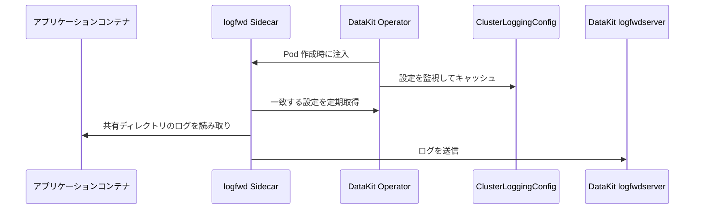

# DataKit Operator による logfwd の注入

logfwd は、コンテナの標準出力に書き込まれないファイルログを収集します。DataKit Operator は対象 Pod に `datakit-logfwd` Sidecar を注入し、アプリケーションコンテナのログディレクトリを Sidecar と共有します。Sidecar はログを DataKit の `logfwdserver` へ送信します。

v1.7.0 以降では、`ClusterLoggingConfig` CRD による収集設定の一元管理を推奨します。Sidecar はデフォルトで 60 秒ごとに Operator から最新の設定を取得するため、収集ルールの更新時にアプリケーション Pod を再作成する必要はありません。



## 前提条件 {#prerequisites}

- DataKit で `logfwdserver` が有効になっていること。デフォルトでは `9533` ポートをリッスンします。
- DataKit Service で `9533` が公開され、アプリケーション Pod から DataKit へアクセスできること。
- 動的設定を使用する場合は、クラスターに `logging.datakits.io/v1alpha1 ClusterLoggingConfig` CRD がインストールされ、Operator の ServiceAccount に `get`、`list`、`watch` 権限があること。
- logfwd Sidecar からアプリケーションのログディレクトリへアクセスできること。このディレクトリには共有 EmptyDir を使用するか、`log_volume_paths` に基づいて Operator に作成およびマウントさせます。

旧方式の使用方法については、[v1.6.0 以前の logfwd 注入](operator-v1.6.0-logfwd.md)を参照してください。

## Operator の設定 {#datakit-operator-inject-logfwd-instructions}

`admission_inject_v2.logfwds` にルールを追加します。

```json
{
    "admission_inject_v2": {
        "logfwds": [
            {
                "name": "logfwd-app",
                "namespace_selectors": ["^middleware$"],
                "label_selectors": ["app=logging"],
                "check_annotation": false,
                "image": "{{.LogfwdImage}}",
                "envs": {
                    "LOGFWD_DATAKIT_HOST": "{fieldRef:status.hostIP}",
                    "LOGFWD_DATAKIT_PORT": "9533",
                    "LOGFWD_DATAKIT_OPERATOR_ENDPOINT": "datakit-operator.datakit.svc:443",
                    "LOGFWD_GLOBAL_SERVICE": "{fieldRef:metadata.labels['app']}",
                    "LOGFWD_POD_NAME": "{fieldRef:metadata.name}",
                    "LOGFWD_POD_NAMESPACE": "{fieldRef:metadata.namespace}",
                    "LOGFWD_POD_IP": "{fieldRef:status.podIP}"
                },
                "log_configs": "",
                "log_volume_paths": ["/var/log/app"],
                "resources": {
                    "requests": {
                        "cpu": "100m",
                        "memory": "128Mi"
                    },
                    "limits": {
                        "cpu": "200m",
                        "memory": "256Mi"
                    }
                }
            }
        ]
    }
}
```

主なフィールドは次のとおりです。

| フィールド | 説明 |
| --- | --- |
| `name` | ルール名。ログでの特定に使用するため、設定を推奨します |
| `namespace_selectors` | Namespace の正規表現配列 |
| `label_selectors` | Pod Label Selector の配列 |
| `check_annotation` | 旧方式との互換性を保つスイッチ。`true` の場合は `admission.datakit/logfwd.instances` も必要です |
| `image` | logfwd Sidecar のイメージ |
| `envs` | Sidecar の環境変数 |
| `log_configs` | 省略可能な静的ログ設定の JSON 文字列 |
| `log_volume_paths` | アプリケーションコンテナと Sidecar の間で共有するログディレクトリ |
| `resources` | Sidecar のリソース設定。未指定または無効な場合はデフォルト値を使用します |

Selector と Annotation の共通ルールについては、[DataKit Operator の注入ルール](datakit-operator.md#datakit-operator-inject)を参照してください。logfwd は最初に一致したルールを使用します。

### 環境変数 {#envs}

| 環境変数 | 説明 |
| --- | --- |
| `LOGFWD_DATAKIT_HOST` | DataKit のアドレス。通常はノード IP を使用します |
| `LOGFWD_DATAKIT_PORT` | DataKit の `logfwdserver` ポート。デフォルトは `9533` |
| `LOGFWD_DATAKIT_OPERATOR_ENDPOINT` | CRD 設定を動的に取得するための Operator アドレス。プロトコルを省略すると `https://` が自動的に使用されます |
| `LOGFWD_GLOBAL_SOURCE` | すべてのログ設定の `source` を上書き |
| `LOGFWD_GLOBAL_SERVICE` | 個別設定に `service` がない場合に使用するグローバル値 |
| `LOGFWD_GLOBAL_STORAGE_INDEX` | すべてのログ設定の `storage_index` を上書き |
| `LOGFWD_GLOBAL_FROM_BEGINNING_THRESHOLD_SIZE` | ファイル先頭からの収集に使用するグローバルしきい値。単位はバイト |
| `LOGFWD_POD_NAME` | `pod_name` タグへ書き込み |
| `LOGFWD_POD_NAMESPACE` | `namespace` タグへ書き込み |
| `LOGFWD_POD_IP` | `pod_ip` タグへ書き込み |

### 設定ソース {#log-configs}

logfwd は3種類の設定ソースをサポートします。

1. 推奨：`LOGFWD_DATAKIT_OPERATOR_ENDPOINT` から `ClusterLoggingConfig` を動的に取得します。
1. ルールの `log_configs` に静的タスクを設定します。
1. 旧方式との互換性：`admission.datakit/logfwd.instances` Annotation で設定します。

`log_configs` は空にできます。ルールが一致すれば、Operator は Sidecar を注入し、ネットワーク経由で CRD 設定を取得できるようにします。3種類のソースのいずれにも有効な設定がない場合、Sidecar は注入されますが、ログ収集タスクはありません。

静的な `log_configs` の例：

```json
[
    {
        "type": "file",
        "source": "app",
        "service": "checkout",
        "path": "/var/log/app/*.log",
        "multiline_match": "^\\d{4}-\\d{2}-\\d{2}",
        "from_beginning": false,
        "tags": {
            "env": "production"
        }
    }
]
```

この配列は JSON 文字列として、Operator 設定の `log_configs` に指定します。主なフィールドには `type`、`source`、`path`、`service`、`pipeline`、`storage_index`、`multiline_match`、`from_beginning`、`from_beginning_threshold_size`、`character_encoding`、および `tags` があります。

### ログディレクトリ {#volume-paths}

`log_volume_paths` には Sidecar が読み取るディレクトリを指定します。例：

```json
{
    "log_volume_paths": ["/var/log/app", "/data/log"]
}
```

- アプリケーションコンテナで対象パスに EmptyDir がすでにマウントされている場合、Operator は同じボリュームを Sidecar に読み取り専用でマウントします。
- 対応するマウントがない場合、Operator は EmptyDir を作成し、すべての通常のアプリケーションコンテナと Sidecar にマウントします。
- 同じパスで EmptyDir 以外が使用されている場合、Operator は競合を記録し、そのパスをスキップします。
- マウントの競合を避けるため、親ディレクトリと子ディレクトリを同時に指定しないでください。

動的 CRD で更新できるのは収集タスクだけで、作成済み Pod のボリュームは変更できません。CRD に新しいファイルパスを追加する前に、そのディレクトリが `log_volume_paths` またはアプリケーション Pod 自身の EmptyDir を介して Sidecar と共有されていることを確認してください。

## ClusterLoggingConfig {#crd-config}

次のリソースは、`middleware` Namespace 内で `app=logging` ラベルを持つ Pod に一致します。

```yaml
apiVersion: logging.datakits.io/v1alpha1
kind: ClusterLoggingConfig
metadata:
  name: app-logs
spec:
  selector:
    namespaceRegex: "^middleware$"
    podLabelSelector: "app=logging"
  podTargetLabels:
    - app
    - env
  configs:
    - type: file
      source: app
      service: checkout
      path: /var/log/app/*.log
      multiline_match: "^\\d{4}-\\d{2}-\\d{2}"
      tags:
        team: checkout
```

Operator リポジトリは、この CRD をインストールしません。全フィールドと CRD のインストール方法については、[Kubernetes コンテナログの CRD 設定](../integrations/container-log-for-k8s-crd.md)を参照してください。

## Deployment の例 {#inject-logfwd-example}

```yaml
apiVersion: apps/v1
kind: Deployment
metadata:
  name: logging-demo
  namespace: middleware
spec:
  replicas: 1
  selector:
    matchLabels:
      app: logging
  template:
    metadata:
      labels:
        app: logging
      annotations:
        admission.datakit/logfwd.enabled: "true"
    spec:
      containers:
        - name: app
          image: nginx:1.25
          volumeMounts:
            - name: app-logs
              mountPath: /var/log/app
      volumes:
        - name: app-logs
          emptyDir: {}
```

作成後、次のコマンドで確認します。

```shell
kubectl -n middleware get pod -l app=logging
kubectl -n middleware get pod -l app=logging -o yaml
kubectl logs -n datakit deployment/datakit-operator
```

Pod には `datakit-logfwd` Sidecar が含まれ、`/var/log/app` が共有されている必要があります。ログが収集されない場合は、DataKit の `9533` ポート、`LOGFWD_DATAKIT_OPERATOR_ENDPOINT`、`ClusterLoggingConfig` のマッチング結果、および Sidecar のログを確認してください。
