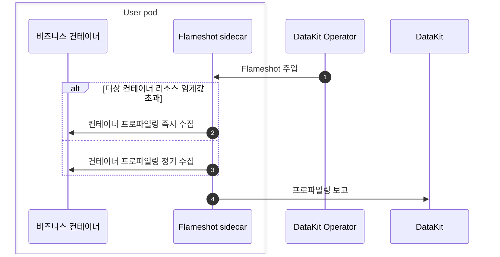

# DataKit Operator에 Flameshot 주입

[:octicons-tag-24: Operator Version-1.8.0](operator-changelog.md#cl-1.8.0)

---

Flameshot은 기존 Profiler(async-profiler, py-spy 등)를 대체하기 위해 DataKit-Operator에 도입된 성능 분석 도구입니다.



## 사전 요구 사항 {#flameshot-prerequisites}

- 클러스터에 [DataKit](https://docs.<<<custom_key.brand_main_domain>>>/datakit/datakit-daemonset-deploy/){:target="_blank"}이 설치되어 있어야 합니다.
- [profile 수집기를 활성화](https://docs.<<<custom_key.brand_main_domain>>>/datakit/datakit-daemonset-deploy/#using-k8-env){:target="_blank"}합니다.
- (선택 사항) Prometheus Annotations 자동 주입 기능을 사용하려면 DataKit의 KubernetesPrometheus 수집기를 활성화하고 `EnableDiscoveryOfPrometheusPodAnnotations = true`을 구성하여 Pod Annotations 자동 탐색 기능을 활성화해야 합니다.

## 사용 방법 {#flameshot-usage}

1. 대상 Kubernetes 클러스터에서 [DataKit-Operator를 다운로드하여 설치](datakit-operator.md#install)합니다.
1. DataKit Operator 구성에서 `flameshots` 배열을 설정하고, `namespace_selectors`/`label_selectors` 일치 규칙을 구성한 다음 `processes` 필드로 모니터링할 프로세스를 지정합니다.
1. (선택 사항) Deployment에 지정된 Annotation `admission.datakit/flameshot.enabled: "true"`을 추가하여 Flameshot 주입을 허용합니다(`"false"`로 설정하면 주입이 비활성화됩니다).

Flameshot 구성 예시:

```json
{
    "admission_inject_v2": {
        "flameshots": [
            {
                "namespace_selectors": [],
                "label_selectors":     [],
                "image": "{{.FlameshotImage}}",
                "envs": {
                    "FLAMESHOT_DATAKIT_ADDR":     "http://datakit-service.datakit:9529/profiling/v1/input",
                    "FLAMESHOT_MONITOR_INTERVAL": "10s",
                    "FLAMESHOT_LOG_LEVEL":        "info",
                    "FLAMESHOT_PROFILING_PATH":   "/flameshot-data",
                    "FLAMESHOT_LOG_PATH":         "/var/log/flameshot.log",
                    "FLAMESHOT_PROFILING_ENABLED": "true",
                    "FLAMESHOT_AUTO_PROFILING":   "10m",
                    "FLAMESHOT_AUTO_PROFILING_DURATION": "15s",
                    "FLAMESHOT_OOM_HPROF_ENABLED": "true",
                    "FLAMESHOT_OOM_HPROF_MATCH_WINDOW": "3m",
                    "FLAMESHOT_HPROF_UPLOAD_ENABLED": "true",
                    "FLAMESHOT_HPROF_UPLOAD_PROVIDER": "oss",
                    "FLAMESHOT_HPROF_UPLOAD_AUTH_TYPE": "static",
                    "FLAMESHOT_HPROF_UPLOAD_ENDPOINT": "https://oss-cn-hangzhou.aliyuncs.com",
                    "FLAMESHOT_HPROF_UPLOAD_REGION": "cn-hangzhou",
                    "FLAMESHOT_HPROF_UPLOAD_BUCKET": "heap-dumps",
                    "FLAMESHOT_HPROF_UPLOAD_ACCESS_KEY_ID": "<access-key-id>",
                    "FLAMESHOT_HPROF_UPLOAD_ACCESS_KEY_SECRET": "<access-key-secret>",
                    "FLAMESHOT_HPROF_UPLOAD_SECURITY_TOKEN": "<sts-security-token>",
                    "FLAMESHOT_HEAP_DUMP_ENABLED": "true",
                    "FLAMESHOT_POD_MEM_LIMIT": "2048",
                    "FLAMESHOT_HTTP_LOCAL_IP":    "{fieldRef:status.podIP}",
                    "FLAMESHOT_HTTP_LOCAL_PORT":  "8089",
                    "FLAMESHOT_SERVICE":  "{fieldRef:metadata.labels['app']}",
                    "FLAMESHOT_TAGS": "pod_name:$(POD_NAME),pod_namespace:$(POD_NAMESPACE),host:$(NODE_NAME)"
                },
                "resources": {
                    "requests": {
                        "cpu":    "100m",
                        "memory": "128Mi"
                    },
                    "limits": {
                        "cpu":    "200m",
                        "memory": "256Mi"
                    }
                },
                "processes": "",
                "enable_prometheus_annotations": true
            }
        ]
    }
}
```

구성 필드 설명:

| 필드                            | 유형    | 필수     | 설명                                                                                                  |
| ------                          | ------  | ------   | ------                                                                                                |
| `namespace_selectors`           | array   | 아니요       | 네임스페이스 selector 배열이며 정규식 일치를 지원합니다.                                                                |
| `label_selectors`               | array   | 아니요       | Label Selector 배열이며 Kubernetes Label Selector 구문을 사용합니다.                                                  |
| `image`                         | string  | 예       | Flameshot 컨테이너 이미지 주소입니다.                                                                                |
| `envs`                          | object  | 아니요       | 환경 변수 구성이며 Downward API를 지원합니다.                                                                       |
| `resources`                     | object  | 아니요       | 리소스 제한 구성(requests 및 limits)입니다.                                                                   |
| `processes`                     | string  | 예       | 프로세스 모니터링 구성(JSON 문자열)이며 `FLAMESHOT_PROCESSES` 환경 변수로 Flameshot 컨테이너에 주입됩니다. 형식은 [Flameshot 관련 문서](../integrations/flameshot.md)를 참조하십시오. |
| `enable_prometheus_annotations` | boolean | 아니요       | Prometheus 관련 Annotations를 자동으로 추가할지 여부입니다. 기본 구성 템플릿에서는 `true`이며, 사용자가 구성을 사용자 지정하면서 이 필드를 설정하지 않으면 기본값은 `false`입니다. Pod에 `prometheus.io/`로 시작하는 Annotation이 하나라도 있으면 주입하지 않습니다. |

<!-- markdownlint-disable MD046 -->
???+ important

    **중요 안내**: `processes` 필드는 JSON 문자열이며, 해당 값은 `FLAMESHOT_PROCESSES` 환경 변수로 Flameshot 컨테이너에 직접 주입됩니다. `processes` 필드의 형식과 의미는 [Flameshot 관련 문서](../integrations/flameshot.md)를 참조하십시오. `processes`이 비어 있으면 Flameshot 주입을 건너뜁니다.
<!-- markdownlint-enable MD046 -->

### 환경 변수 {#envs}

| 환경 변수 이름                   | 설명                                                                                      |
| :---                         | :---                                                                                      |
| `FLAMESHOT_DATAKIT_ADDR`     | DataKit 프로파일링 수신 주소(예: `http://datakit-service.datakit:9529/profiling/v1/input`) |
| `FLAMESHOT_MONITOR_INTERVAL` | 모니터링 간격(예: `10s`)                                                                      |
| `FLAMESHOT_LOG_LEVEL`        | 로그 수준(예: `info`)                                                                     |
| `FLAMESHOT_PROFILING_PATH`   | 프로파일링 데이터 저장 경로(예: `/flameshot-data`)                                            |
| `FLAMESHOT_LOG_PATH`         | 로그 파일 경로(예: `/var/log/flameshot.log`)                                               |
| `FLAMESHOT_PROFILING_ENABLED` | JFR 프로파일링 활성화 여부(예: `true`)                                                     |
| `FLAMESHOT_AUTO_PROFILING`   | 정기 수집 간격(예: `10m`)                                                                  |
| `FLAMESHOT_AUTO_PROFILING_DURATION` | 정기 수집 1회당 지속 시간(예: `15s`)                                                        |
| `FLAMESHOT_OOM_HPROF_ENABLED` | OOM `.hprof` 요약 복구 활성화 여부(예: `true`)                                            |
| `FLAMESHOT_OOM_HPROF_MATCH_WINDOW` | OOM 이벤트와 `.hprof`의 일치 시간 범위(예: `3m`)                                          |
| `FLAMESHOT_HPROF_UPLOAD_ENABLED` | hprof 객체 스토리지 업로드 활성화 여부(예: `true`)                                            |
| `FLAMESHOT_HPROF_UPLOAD_PROVIDER` | 객체 스토리지 유형이며 `oss` 및 `s3`를 지원합니다.                                                    |
| `FLAMESHOT_HPROF_UPLOAD_AUTH_TYPE` | hprof 업로드 인증 유형입니다. `static`은 AK/SK를 직접 사용하며 STS SecurityToken을 선택적으로 사용할 수 있음을 의미합니다. `assume_role`은 소스 AK/SK로 Alibaba Cloud STS AssumeRole을 호출하여 임시 자격 증명을 가져오고 갱신함을 의미합니다. `assume_role`은 OSS만 지원하며 Flameshot 0.2.4 이상이 필요합니다. |
| `FLAMESHOT_HPROF_UPLOAD_ENDPOINT` | OSS/S3 endpoint                                                                      |
| `FLAMESHOT_HPROF_UPLOAD_REGION` | OSS/S3 region(예: `cn-hangzhou` 또는 `us-east-1`)                                   |
| `FLAMESHOT_HPROF_UPLOAD_BUCKET` | 대상 bucket                                                                          |
| `FLAMESHOT_HPROF_UPLOAD_ACCESS_KEY_ID` | 객체 스토리지 AK                                                                    |
| `FLAMESHOT_HPROF_UPLOAD_ACCESS_KEY_SECRET` | 객체 스토리지 SK                                                                |
| `FLAMESHOT_HPROF_UPLOAD_SECURITY_TOKEN` | 선택적 Alibaba Cloud OSS STS SecurityToken입니다. 임시 AK/SK와 함께 구성하면 STS 인증을 사용합니다. Flameshot 0.2.3 이상이 필요하며 자격 증명이 만료되기 전에 Pod를 다시 생성해야 합니다. |
| `FLAMESHOT_HPROF_UPLOAD_ASSUME_ROLE_ARN` | `assume_role` 인증 모드에서 필수이며 대상 RAM Role ARN입니다. |
| `FLAMESHOT_HPROF_UPLOAD_ASSUME_ROLE_SOURCE_ACCESS_KEY_ID` | `assume_role` 인증 모드에서 필수이며 STS AssumeRole을 호출하는 소스 자격 증명의 AK입니다. 최소한의 `sts:AssumeRole` 권한만 부여하는 것이 좋습니다. |
| `FLAMESHOT_HPROF_UPLOAD_ASSUME_ROLE_SOURCE_ACCESS_KEY_SECRET` | `assume_role` 인증 모드에서 필수이며 STS AssumeRole을 호출하는 소스 자격 증명의 SK입니다. |
| `FLAMESHOT_HPROF_UPLOAD_ASSUME_ROLE_SOURCE_SECURITY_TOKEN` | 선택 사항입니다. 소스 자격 증명 자체가 임시 자격 증명인 경우 소스 자격 증명의 SecurityToken을 구성할 수 있습니다. |
| `FLAMESHOT_HPROF_UPLOAD_ASSUME_ROLE_SESSION_NAME` | 선택적 AssumeRole 역할 세션 이름입니다. |
| `FLAMESHOT_HPROF_UPLOAD_ASSUME_ROLE_DURATION_SECONDS` | 선택 사항이며 AssumeRole이 반환하는 STS 자격 증명의 유효 기간입니다. 단위는 초이고 기본값은 `3600`이며 최솟값은 `900`입니다. |
| `FLAMESHOT_HPROF_UPLOAD_ASSUME_ROLE_POLICY` | 선택적 inline policy이며 반환되는 STS 자격 증명의 권한을 추가로 제한하는 데 사용합니다. |
| `FLAMESHOT_HPROF_UPLOAD_ASSUME_ROLE_EXTERNAL_ID` | 선택적 ExternalId이며 계정 간 또는 confused deputy 방지 사용 사례에 사용합니다. |
| `FLAMESHOT_HPROF_UPLOAD_ASSUME_ROLE_STS_ENDPOINT` | 선택적 STS endpoint(예: `sts.cn-hangzhou.aliyuncs.com`) |
| `FLAMESHOT_HEAP_DUMP_ENABLED` | 메모리 긴급 임계값 도달 시 능동 Heap Dump 활성화 여부(예: `true`)                                      |
| `FLAMESHOT_HEAP_DUMP_JMAP_PATH` | `jmap` 실행 파일 경로입니다. 공식 Sidecar 이미지에는 기본적으로 JVM/JDK가 포함되지 않으므로 능동 Heap Dump를 활성화할 때는 사용 가능한 `jmap`을 명시적으로 제공해야 합니다. |
| `FLAMESHOT_POD_MEM_LIMIT`    | Pod 메모리 limit이며 단위는 Mi입니다(예: `2048`).                                                      |
| `FLAMESHOT_HTTP_LOCAL_IP`    | HTTP 서비스의 로컬 IP이며 일반적으로 Downward API를 통해 주입합니다(예: `{fieldRef:status.podIP}`).              |
| `FLAMESHOT_HTTP_LOCAL_PORT`  | HTTP 서비스 포트(예: `8089`)                                                                |
| `FLAMESHOT_PROCESSES`        | 프로세스 모니터링 구성(`processes` 필드에서 자동 주입)이며 JSON 문자열 형식입니다.                              |

Flameshot이 Alibaba Cloud STS `AssumeRole`을 능동적으로 호출하여 임시 OSS 업로드 자격 증명을 얻도록 하려면 Operator를 수정할 필요가 없습니다. 기존 `envs`을 통해 AssumeRole 구성을 주입하기만 하면 됩니다. 소스 AK/SK는 `{secretKeyRef:...}`을 사용하여 Kubernetes Secret을 참조하는 것이 좋습니다. Flameshot은 AssumeRole이 반환한 임시 자격 증명을 프로세스 내에서 캐시하고 갱신합니다. STS 호출이 실패하거나 구성이 누락되면 업로드가 실패하며 기본 자격 증명 체인, 노드 역할 또는 익명 업로드로 대체되지 않습니다.

### Flameshot 자체 실시간 수집 {#prom-anno}

`enable_prometheus_annotations`을 `true`로 설정하면(기본 구성 템플릿에서는 `true`) DataKit-Operator가 Flameshot이 주입된 Pod에 다음 Prometheus 관련 Annotations를 자동으로 추가하여 Flameshot 자체 메트릭을 수집할 수 있도록 합니다(DataKit의 KubernetesPrometheus 수집을 통해 수행).

- `prometheus.io/scrape: "true"`: 해당 Pod를 수집해야 함을 나타냅니다.
- `prometheus.io/port: "<port>"`: 메트릭 노출 포트이며 환경 변수 `FLAMESHOT_HTTP_LOCAL_PORT`의 값을 사용합니다(예: `"8089"`).
- `prometheus.io/scheme: "http"`: 메트릭 수집 프로토콜
- `prometheus.io/path: "/metrics"`: 메트릭 경로
- `prometheus.io/param_measurement: "flameshot"`: measurement 이름 지정

<!-- markdownlint-disable MD046 -->
???+ warning

    1. Pod에 `prometheus.io/`로 시작하는 Annotation이 하나라도 있으면 기존 메트릭 수집 구성을 덮어쓰지 않도록 DataKit-Operator는 위의 Prometheus Annotations를 주입하지 않습니다.
    1. 이 기능을 사용하려면 DataKit에서 KubernetesPrometheus 수집기를 활성화하고 `EnableDiscoveryOfPrometheusPodAnnotations = true`을 구성하여 Pod Annotations 자동 탐색 기능을 활성화해야 합니다.
<!-- markdownlint-enable MD046 -->

## 사용 예 {#flameshot-example}

> **Annotation 사용 안내**: `check_annotation` 구성이 버전 Annotation의 동작에 미치는 영향과 각 Annotation에 대한 자세한 설명은 [Annotation 구성 주입](datakit-operator.md#annotation-injection) 및 [`check_annotation` 구성 항목 설명](datakit-operator.md#check-annotation-config)을 참조하십시오.

<!-- markdownlint-disable MD046 -->
???+ warning

    - `admission.datakit/flameshot.enabled: "true"` Annotation만 추가해서는 주입이 트리거되지 않습니다. DataKit-Operator 구성에도 일치하는 `flameshots` 규칙(`namespace_selectors`/`label_selectors` 및 `processes` 필드 포함)을 설정해야 합니다.
    - `processes` 필드가 비어 있으면 주입을 건너뜁니다.
<!-- markdownlint-enable MD046 -->

다음은 Deployment에서 생성하는 모든 Pod에 Flameshot을 주입하는 Deployment 예시입니다(DataKit-Operator 구성에 일치하는 규칙이 설정되어 있어야 합니다).

```yaml
apiVersion: apps/v1
kind: Deployment
metadata:
  name: app-deployment
  labels:
    app: myapp
spec:
  replicas: 1
  selector:
    matchLabels:
      app: myapp
  template:
    metadata:
      labels:
        app: myapp
      annotations:
        admission.datakit/flameshot.enabled: "true"
    spec:
      containers:
      - name: app
        image: myapp:latest
        ports:
        - containerPort: 8080
```

YAML 파일로 리소스를 생성합니다.

```shell
$ kubectl apply -f app-deployment.yaml
...
```

다음과 같이 확인합니다.

```shell
$ kubectl get pod

NAME                                   READY   STATUS    RESTARTS      AGE
app-deployment-7bd8dd85f-fzmt2          2/2     Running   0             4s

$ kubectl get pod app-deployment-7bd8dd85f-fzmt2 -o=jsonpath={.spec.containers\[\*\].name}
app datakit-flameshot
```

몇 분 기다리면 <<<custom_key.brand_name>>> 콘솔의 [APM-프로파일링](https://console.<<<custom_key.brand_main_domain>>>/tracing/profile){:target="_blank"} 페이지에서 애플리케이션 성능 데이터를 확인할 수 있습니다.

<!-- markdownlint-disable MD046 -->
???+ note

    데이터가 표시되지 않으면 `datakit-flameshot` 컨테이너에 들어가 해당 로그를 확인하여 문제를 해결할 수 있습니다.

    ```shell
    $ kubectl exec -it app-deployment-7bd8dd85f-fzmt2 -c datakit-flameshot -- bash
    $ cat /var/log/flameshot.log
    ```
<!-- markdownlint-enable MD046 -->