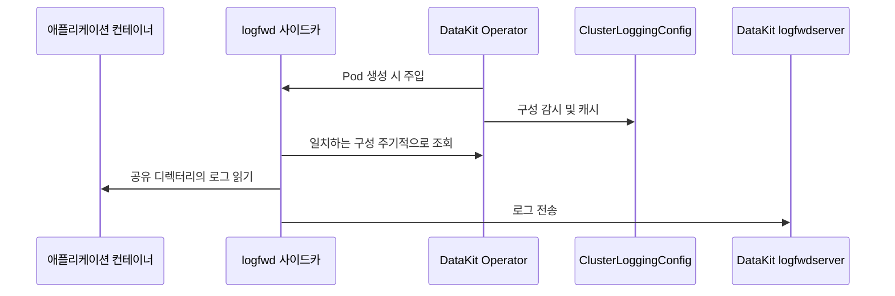

# DataKit Operator logfwd 주입

logfwd는 컨테이너 표준 출력에 기록되지 않는 파일 로그를 수집합니다. DataKit Operator는 대상 Pod에 `datakit-logfwd` 사이드카를 주입하고 애플리케이션 컨테이너의 로그 디렉터리를 사이드카와 공유합니다. 사이드카는 로그를 DataKit `logfwdserver`로 전송합니다.

v1.7.0부터 `ClusterLoggingConfig` CRD를 사용하여 수집 구성을 중앙에서 관리하는 방식을 권장합니다. 사이드카는 기본적으로 60초마다 Operator에서 최신 구성을 가져오므로 수집 규칙을 업데이트할 때 애플리케이션 Pod를 다시 생성할 필요가 없습니다.



## 사전 요구 사항 {#prerequisites}

- DataKit에서 `logfwdserver`를 활성화해야 합니다. 기본 수신 포트는 `9533`입니다.
- DataKit Service에서 `9533` 포트를 노출하고 애플리케이션 Pod에서 DataKit에 접근할 수 있어야 합니다.
- 동적 구성을 사용할 때는 클러스터에 `logging.datakits.io/v1alpha1 ClusterLoggingConfig` CRD가 설치되어 있고 Operator ServiceAccount에 `get`, `list`, `watch` 권한이 있어야 합니다.
- logfwd 사이드카에서 애플리케이션 로그 디렉터리에 접근할 수 있어야 합니다. 이 디렉터리는 공유 EmptyDir를 사용하거나 Operator가 `log_volume_paths`에 따라 생성하여 마운트해야 합니다.

레거시 사용법은 [v1.6.0 이하 버전의 logfwd 주입](operator-v1.6.0-logfwd.md)을 참조하십시오.

## Operator 구성 {#datakit-operator-inject-logfwd-instructions}

`admission_inject_v2.logfwds`에 규칙을 추가합니다.

```json
{
    "admission_inject_v2": {
        "logfwds": [
            {
                "name": "logfwd-app",
                "namespace_selectors": ["^middleware$"],
                "label_selectors": ["app=logging"],
                "check_annotation": false,
                "image": "{{.LogfwdImage}}",
                "envs": {
                    "LOGFWD_DATAKIT_HOST": "{fieldRef:status.hostIP}",
                    "LOGFWD_DATAKIT_PORT": "9533",
                    "LOGFWD_DATAKIT_OPERATOR_ENDPOINT": "datakit-operator.datakit.svc:443",
                    "LOGFWD_GLOBAL_SERVICE": "{fieldRef:metadata.labels['app']}",
                    "LOGFWD_POD_NAME": "{fieldRef:metadata.name}",
                    "LOGFWD_POD_NAMESPACE": "{fieldRef:metadata.namespace}",
                    "LOGFWD_POD_IP": "{fieldRef:status.podIP}"
                },
                "log_configs": "",
                "log_volume_paths": ["/var/log/app"],
                "resources": {
                    "requests": {
                        "cpu": "100m",
                        "memory": "128Mi"
                    },
                    "limits": {
                        "cpu": "200m",
                        "memory": "256Mi"
                    }
                }
            }
        ]
    }
}
```

주요 필드는 다음과 같습니다.

| 필드 | 설명 |
| --- | --- |
| `name` | 로그에서 규칙을 식별하는 이름. 구성을 권장합니다. |
| `namespace_selectors` | Namespace 정규식 배열 |
| `label_selectors` | Pod Label Selector 배열 |
| `check_annotation` | 레거시 호환 설정. `true`이면 `admission.datakit/logfwd.instances`도 있어야 합니다. |
| `image` | logfwd 사이드카 이미지 |
| `envs` | 사이드카 환경 변수 |
| `log_configs` | 선택 사항인 정적 로그 구성 JSON 문자열 |
| `log_volume_paths` | 애플리케이션 컨테이너와 사이드카가 공유할 로그 디렉터리 |
| `resources` | 사이드카 리소스 구성. 없거나 잘못된 경우 기본값을 사용합니다. |

Selector 및 Annotation의 공통 규칙은 [DataKit Operator 주입 규칙](datakit-operator.md#datakit-operator-inject)을 참조하십시오. logfwd는 첫 번째로 일치하는 규칙을 사용합니다.

### 환경 변수 {#envs}

| 환경 변수 | 설명 |
| --- | --- |
| `LOGFWD_DATAKIT_HOST` | DataKit 주소. 일반적으로 노드 IP를 사용합니다. |
| `LOGFWD_DATAKIT_PORT` | DataKit `logfwdserver` 포트. 기본값은 `9533`입니다. |
| `LOGFWD_DATAKIT_OPERATOR_ENDPOINT` | CRD 구성을 동적으로 가져올 Operator 주소. 프로토콜을 생략하면 자동으로 `https://`를 사용합니다. |
| `LOGFWD_GLOBAL_SOURCE` | 모든 로그 구성의 `source` 덮어쓰기 |
| `LOGFWD_GLOBAL_SERVICE` | 개별 구성에 `service`가 없을 때 사용할 전역 값 |
| `LOGFWD_GLOBAL_STORAGE_INDEX` | 모든 로그 구성의 `storage_index` 덮어쓰기 |
| `LOGFWD_GLOBAL_FROM_BEGINNING_THRESHOLD_SIZE` | 전역 파일 시작 지점 수집 임계값. 단위는 바이트입니다. |
| `LOGFWD_POD_NAME` | `pod_name` 태그에 기록 |
| `LOGFWD_POD_NAMESPACE` | `namespace` 태그에 기록 |
| `LOGFWD_POD_IP` | `pod_ip` 태그에 기록 |

### 구성 소스 {#log-configs}

logfwd는 다음 세 가지 구성 소스를 지원합니다.

1. 권장: `LOGFWD_DATAKIT_OPERATOR_ENDPOINT`를 통해 `ClusterLoggingConfig`를 동적으로 가져옵니다.
1. 규칙의 `log_configs`에 정적 작업을 구성합니다.
1. 레거시 호환: `admission.datakit/logfwd.instances` Annotation을 통해 구성합니다.

`log_configs`는 비워 둘 수 있습니다. 규칙이 일치하면 Operator는 사이드카를 주입하여 네트워크를 통해 CRD 구성을 가져올 수 있게 합니다. 세 소스 모두 유효한 구성을 제공하지 않으면 사이드카는 주입되지만 로그 수집 작업은 없습니다.

정적 `log_configs` 예시:

```json
[
    {
        "type": "file",
        "source": "app",
        "service": "checkout",
        "path": "/var/log/app/*.log",
        "multiline_match": "^\\d{4}-\\d{2}-\\d{2}",
        "from_beginning": false,
        "tags": {
            "env": "production"
        }
    }
]
```

이 배열은 Operator 구성의 `log_configs`에 JSON 문자열로 작성해야 합니다. 주요 필드는 `type`, `source`, `path`, `service`, `pipeline`, `storage_index`, `multiline_match`, `from_beginning`, `from_beginning_threshold_size`, `character_encoding` 및 `tags`입니다.

### 로그 디렉터리 {#volume-paths}

`log_volume_paths`는 사이드카에서 읽을 디렉터리를 지정합니다. 예:

```json
{
    "log_volume_paths": ["/var/log/app", "/data/log"]
}
```

- 애플리케이션 컨테이너의 해당 경로에 EmptyDir가 이미 마운트되어 있으면 Operator는 같은 볼륨을 사이드카에 읽기 전용으로 마운트합니다.
- 해당 마운트가 없으면 Operator가 EmptyDir를 생성하고 모든 일반 애플리케이션 컨테이너와 사이드카에 마운트합니다.
- 같은 경로에 EmptyDir가 아닌 볼륨이 사용 중이면 Operator는 충돌을 기록하고 그 경로를 건너뜁니다.
- 마운트 충돌을 방지하려면 상위 디렉터리와 하위 디렉터리를 함께 구성하지 마십시오.

동적 CRD는 수집 작업만 업데이트할 수 있으며 이미 생성된 Pod의 볼륨은 변경할 수 없습니다. CRD에 새 파일 경로를 추가하기 전에 해당 디렉터리가 `log_volume_paths` 또는 애플리케이션 Pod 자체의 EmptyDir를 통해 사이드카와 공유되어 있는지 확인하십시오.

## ClusterLoggingConfig {#crd-config}

다음 리소스는 `middleware` Namespace에서 `app=logging` Label이 있는 Pod와 일치합니다.

```yaml
apiVersion: logging.datakits.io/v1alpha1
kind: ClusterLoggingConfig
metadata:
  name: app-logs
spec:
  selector:
    namespaceRegex: "^middleware$"
    podLabelSelector: "app=logging"
  podTargetLabels:
    - app
    - env
  configs:
    - type: file
      source: app
      service: checkout
      path: /var/log/app/*.log
      multiline_match: "^\\d{4}-\\d{2}-\\d{2}"
      tags:
        team: checkout
```

Operator 저장소에서는 이 CRD를 설치하지 않습니다. 전체 필드와 CRD 설치 방법은 [Kubernetes 컨테이너 로그 CRD 구성](../integrations/container-log-for-k8s-crd.md)을 참조하십시오.

## Deployment 예시 {#inject-logfwd-example}

```yaml
apiVersion: apps/v1
kind: Deployment
metadata:
  name: logging-demo
  namespace: middleware
spec:
  replicas: 1
  selector:
    matchLabels:
      app: logging
  template:
    metadata:
      labels:
        app: logging
      annotations:
        admission.datakit/logfwd.enabled: "true"
    spec:
      containers:
        - name: app
          image: nginx:1.25
          volumeMounts:
            - name: app-logs
              mountPath: /var/log/app
      volumes:
        - name: app-logs
          emptyDir: {}
```

생성한 후 다음을 확인합니다.

```shell
kubectl -n middleware get pod -l app=logging
kubectl -n middleware get pod -l app=logging -o yaml
kubectl logs -n datakit deployment/datakit-operator
```

Pod에는 `datakit-logfwd` 사이드카가 있어야 하며 `/var/log/app`을 공유해야 합니다. 로그가 수집되지 않으면 DataKit `9533` 포트, `LOGFWD_DATAKIT_OPERATOR_ENDPOINT`, `ClusterLoggingConfig` 일치 결과 및 사이드카 로그를 확인하십시오.
