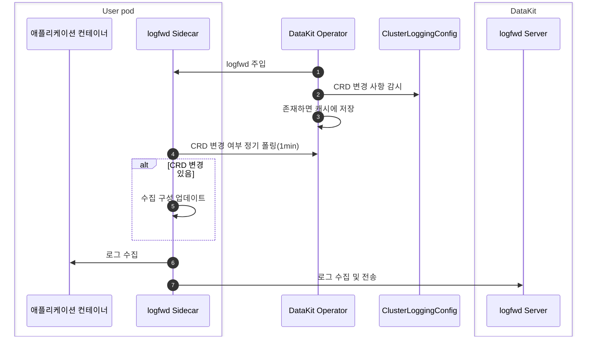

# DataKit Operator logfwd 주입

Operator가 주입하는 logfwd는 주로 Pod 내부 로그(로그가 컨테이너의 stdout에 보존되지 않는 경우)를 수집합니다. Pod에 Sidecar 컨테이너를 주입하고, 이 Sidecar 컨테이너가 컨테이너 내부에서 지정된 명령의 로그를 직접 수집하여 DataKit으로 전송하는 방식으로 구현됩니다.

특정 CRD 구성과 함께 사용하면 logfwd 방식은 대상 Pod를 다시 시작하지 않고도 대상 Pod의 수집 설정을 동적으로 조정할 수 있습니다.




## 사전 조건 {#prerequisites}

1. DataKit에서 `logfwdserver` 수집기를 활성화합니다. 기본 수신 포트는 `9533`입니다.
1. 다른 Pod가 `datakit-service.datakit.svc:9533`에 액세스할 수 있도록 DataKit service에서 `9533` 포트를 개방해야 합니다.

## 사용 안내 {#datakit-operator-inject-logfwd-instructions}

> Operator <= v1.6.0 버전에서 logfwd 주입을 사용하는 방법은 [여기](operator-v1.6.0-logfwd.md)를 참조하십시오.

`ClusterLoggingConfig` CRD를 사용하여 로그 수집 구성을 중앙에서 관리합니다: [:octicons-tag-24: Version-1.7.0](operator-changelog.md#cl-1.7.0)

- **수집 구성 중앙 관리**: Kubernetes `ClusterLoggingConfig` CRD를 감시하고, 매칭 결과를 노출하여 logfwd sidecar가 폴링으로 가져올 수 있도록 지원합니다(sidecar는 기본적으로 60초마다 Operator에 HTTP 요청을 보내며, logfwd는 [:octicons-tag-24: Version-1.86.0](changelog-2025.md#cl-1.86.0)이 필요합니다).
- **핫 업데이트 & 정밀 매칭**: CRD selector(Namespace/Pod/Label/Container) 변경 사항이 즉시 적용되며 Workload를 다시 생성할 필요가 없습니다.
- **구성 간소화**: 로그 수집 구성은 전적으로 CRD를 통해 관리하며, 더 이상 Annotation을 통한 구성 재정의를 지원하지 않습니다.

> 아직 ClusterLoggingConfig의 정의와 작성 방법을 모르는 경우 먼저 [컨테이너 로그 수집 CRD 구성 문서](../integrations/container-log-for-k8s-crd.md)를 읽어 보십시오.

작업 절차:

1. `ClusterLoggingConfig` CRD를 등록합니다(DataKit 문서 참조).
1. DataKit Operator v1.8.0을 업그레이드하거나 설치하고 CRD의 RBAC 읽기 권한을 추가합니다.
1. DataKit Operator 구성에서 `logfwds` 배열을 설정하고 `namespace_selectors`/`label_selectors` 매칭 규칙과 `log_configs` 필드를 구성합니다.
1. (선택 사항) 대상 Pod에 Annotation `admission.datakit/logfwd.enabled: "true"`을 추가하여 주입을 허용합니다(`"false"`로 설정하면 주입을 거부합니다).
1. `ClusterLoggingConfig` 리소스를 생성하면 logfwd sidecar가 수집 구성을 정기적으로 가져옵니다(기본값: 60초).

최신 `datakit-operator.yaml`을 설치하면 필수 권한이 포함됩니다. 또는 다음 최소 예시를 참조하십시오.

<!-- markdownlint-disable MD046 -->
??? "최소 예시"

    ```yaml
    apiVersion: rbac.authorization.k8s.io/v1
    kind: ClusterRole
    metadata:
      name: datakit-operator
    rules:
    - apiGroups: ["logging.datakits.io"]
      resources: ["clusterloggingconfigs"]
      verbs: ["get", "list", "watch"]


    ---
    apiVersion: rbac.authorization.k8s.io/v1
    kind: ClusterRoleBinding
    metadata:
      name: datakit-operator
    roleRef:
      apiGroup: rbac.authorization.k8s.io
      kind: ClusterRole
      name: datakit-operator
    subjects:
    - kind: ServiceAccount
      name: datakit-operator
      namespace: datakit


    ---
    apiVersion: v1
    kind: ServiceAccount
    metadata:
      name: datakit-operator
      namespace: datakit


    ---
    apiVersion: apps/v1
    kind: Deployment
    metadata:
      name: datakit-operator
      namespace: datakit
      labels:
        app: datakit-operator
    spec:
      replicas: 1  # Do not change the ReplicaSet number!
      selector:
         matchLabels:
           app: datakit-operator
      template:
        metadata:
          labels:
            app: datakit-operator
        spec:
          serviceAccountName: datakit-operator
          containers:
          - name: operator
            # other..
    ```

## CRD 구성 {#crd-config}

`ClusterLoggingConfig` 예시:

```yaml
apiVersion: logging.datakits.io/v1alpha1
kind: ClusterLoggingConfig
metadata:
  name: nginx-logs
spec:
  selector:
    namespaceRegex: "^(middleware)$"
    podLabelSelector: "app=logging"
  podTargetLabels:
    - app
    - env
  configs: # 다음 구성은 ConfigMap의 log_configs와 일대일로 대응합니다
    - type: file
      source: nginx-access
      service: nginx
      path: /var/log/nginx/access.log
      pipeline: nginx-access.p
      storage_index: app-logs
      multiline_match: "^\\d{4}-\\d{2}-\\d{2}"
      tags:
        team: web
```

위 리소스를 적용하면 DataKit Operator는 다음을 수행합니다.

1. Deployment 생성 이벤트를 감시하고 `datakit-logfwd` Sidecar 컨테이너를 주입합니다.
1. `ClusterLoggingConfig` selector를 기준으로 Pod를 매칭하고, Sidecar가 폴링할 때 읽을 수 있도록 매칭 결과를 지속적으로 유지합니다.
1. Sidecar가 시작되면 `LOGFWD_DATAKIT_OPERATOR_ENDPOINT`을 통해 Operator와 통신하고 60초마다 CRD 구성을 가져온 후 작업을 DataKit `logfwdserver`으로 전달합니다.

## 로그 수집 구성 {#collection-configs}

Operator를 통해 logfwd를 주입하려면 Operator의 ConfigMap에 다음 구조의 구성을 추가해야 합니다.

```json
{
    "admission_inject_v2": {         // 주입 구성 v2
        "logfwds": [
            // 여기서는 여러 logfwd 구성 그룹을 지원합니다
            { ... }, // 단일 logfwd 구성
            { ... }, // 또 다른 logfwd 구성
        ],
    }
}
```

단일 logfwd에서 지원하는 구성 필드는 다음과 같습니다.

| 필드                  | 유형     | 설명                   | 필수 여부 | 예시 값                       |
| ------:               | :------: | ------                 | ------   | --------                     |
| `envs`                | object   | 환경 변수 구성           | Y        | 아래 예시 참조                   |
| `image`               | string   | logfwd 이미지 주소        | Y        | 아래 예시 참조                   |
| `label_selectors`     | array    | 태그 selector             | Y        | `["logs-enabled=true"]`      |
| `log_configs`         | string   | 로그 구성[^log_configs] | Y        | `"[{\"type\":\"file\"...}]"` |
| `log_volume_paths`    | array    | 로그 Volume 마운트 경로         | Y        | `["/var/log/app"]`           |
| `namespace_selectors` | array    | Namespace selector         | Y        | `["default"]`                |
| `resources`           | object   | 리소스 제한 구성           | N        | 아래 예시 참조                   |
| `check_annotation`    | boolean  | Annotation 검사 스위치(이전 버전 호환) | N        | `false`                      |

[^log_configs]: 복잡한 JSON 문자열이므로 포함할 때 이스케이프해야 합니다.

check_annotation: **logfwd의 `check_annotation`은 주로 이전 버전과의 호환성을 위해 사용됩니다**:
    - `true`로 설정한 경우: Pod에 `admission.datakit/logfwd.instances` Annotation이 있어야 주입됩니다.
    - `false`로 설정하거나 설정하지 않은 경우: `admission.datakit/logfwd.enabled` Annotation과 selector 규칙에 따라 주입 여부를 결정합니다.
    - **v1.8.0+ 버전에서는 `false`를 유지하는 것이 좋습니다**. CRD 방식으로 로그 수집 구성을 관리하십시오.

### 환경 변수 구성 {#envs}

logfwd 주입에 추가된 여러 환경 변수와 이미지 버전 요구 사항은 `datakit-operator-config` ConfigMap에서 구성할 수 있습니다.

```json hl_lines="5-11"
"logfwds": [
    {
        "image": "{{.LogfwdImage}}",
        "envs": {
            "LOGFWD_DATAKIT_HOST":              "{fieldRef:status.hostIP}",
            "LOGFWD_DATAKIT_PORT":              "9533",
            "LOGFWD_DATAKIT_OPERATOR_ENDPOINT": "datakit-operator.datakit.svc:443",
            "LOGFWD_GLOBAL_SERVICE":            "{fieldRef:metadata.labels['app']}",
            "LOGFWD_POD_NAME":                  "{fieldRef:metadata.name}",
            "LOGFWD_POD_NAMESPACE":             "{fieldRef:metadata.namespace}",
            "LOGFWD_POD_IP":                    "{fieldRef:status.podIP}"
        },
        "log_configs": "",
        "log_volume_paths": []
    }
]
```

`envs`에서 선택할 수 있는 항목은 다음과 같습니다.

| 환경 변수 이름                         | 구성 항목 설명                                                                                                                                                                              |
| ---:                               | :---                                                                                                                                                                                    |
| `LOGFWD_DATAKIT_HOST`              | DataKit 인스턴스 주소(IP 또는 확인 가능한 도메인 이름)                                                                                                                                                   |
| `LOGFWD_DATAKIT_PORT`              | DataKit `logfwdserver` 수신 포트(예: `9533`)                                                                                                                                          |
| `LOGFWD_DATAKIT_OPERATOR_ENDPOINT` | DataKit Operator Endpoint입니다. 형식은 `datakit-operator.datakit.svc:443` 또는 `https://datakit-operator.datakit.svc:443`이며 CRD 구성을 조회하는 데 사용합니다. 비워 두면 가져오기를 시도하지 않습니다. `https://` 접두사를 자동으로 추가할 수 있습니다. |
| `LOGFWD_GLOBAL_SOURCE`             | 전역 `source`이며, 개별 구성의 `source` 필드보다 우선순위가 높습니다.                                                                                                                                   |
| `LOGFWD_GLOBAL_SERVICE`            | 전역 `service`입니다. 개별 구성에서 `service`을 지정하지 않으면 전역 값을 사용하며, 전역 값도 비어 있으면 `source`으로 대체됩니다.                                                                                         |
| `LOGFWD_GLOBAL_STORAGE_INDEX`      | 전역 `storage_index`이며, 개별 구성의 `storage_index` 필드보다 우선순위가 높습니다.                                                                                                                     |
| `LOGFWD_GLOBAL_FROM_BEGINNING_THRESHOLD_SIZE` | 전역 `from_beginning_threshold_size`이며, 단위는 바이트입니다. 개별 구성의 `from_beginning_threshold_size` 필드보다 우선순위가 높습니다.                                                                           |
| `LOGFWD_POD_NAME`                  | `pod_name` tag를 자동으로 기록하며, 일반적으로 Downward API를 통해 주입합니다.                                                                                                                                   |
| `LOGFWD_POD_NAMESPACE`             | `namespace` tag를 자동으로 기록합니다.                                                                                                                                                              |
| `LOGFWD_POD_IP`                    | `pod_ip` tag를 자동으로 기록하여 컨테이너 인스턴스를 쉽게 찾을 수 있도록 합니다.                                                                                                                                               |

### 로그 설정 {#log-configs}

`log_configs`은 디버깅하거나 CRD 내용을 재정의하는 데 사용합니다. **`log_configs`이 비어 있으면 logfwd 주입을 건너뜁니다**. 구조 예시:

```json
[
  {
    "type": "file",
    "disable": false,
    "source": "nginx-access",
    "service": "nginx",
    "path": "/var/log/nginx/access.log",
    "pipeline": "nginx-access.p",
    "storage_index": "app-logs",
    "multiline_match": "^\\d{4}-\\d{2}-\\d{2}",
    "remove_ansi_escape_codes": false,
    "from_beginning": false,
    "character_encoding": "utf-8",
    "tags": {
      "env": "production",
      "team": "backend"
    }
  }
]
```

| 필드                             | 유형     | 필수   | 설명                                                                                                  | 예시                                                                                              |
| ------                         : | :------: | ------ | ------                                                                                                | ------                                                                                            |
| `type`                           | string   | Y      | logfwd 수집 유형은 `"file"`만 사용할 수 있습니다.                                                                        | `"file"`                                                                                          |
| `source`                         | string   | Y      | 서로 다른 로그 스트림을 구분하는 로그 소스 식별자입니다.                                                                      | `"nginx-access"`                                                                                  |
| `path`                           | string   | Y      | 로그 파일 경로입니다(glob 패턴 지원). type=file인 경우 필수입니다.                                                      | `"/var/log/nginx/*.log"`                                                                          |
| `disable`                        | boolean  | N      | 이 수집 구성을 비활성화할지 여부입니다.                                                                                    | `false`                                                                                           |
| `service`                        | string   | N      | 로그가 속한 서비스이며, 기본값은 로그 소스(source)입니다.                                                            | `"nginx"`                                                                                         |
| `multiline_match`                | string   | N      | 여러 줄 로그 시작 행의 정규식입니다. JSON에서는 백슬래시를 이스케이프해야 합니다.                                                | `"^\\d{4}-\\d{2}-\\d{2}"`                                                                         |
| `pipeline`                       | string   | N      | 로그 파싱 파이프라인 구성 파일 이름입니다(DataKit 측에서 구성해야 함).                                                       | `"nginx-access.p"`                                                                                |
| `storage_index`                  | string   | N      | 로그를 저장할 인덱스 이름입니다.                                                                                    | `"app-logs"`                                                                                      |
| `remove_ansi_escape_codes`       | boolean  | N      | 로그 데이터에서 ANSI 이스케이프 문자(색상 코드 등)를 삭제할지 여부입니다.                                                        | `false`                                                                                           |
| `from_beginning`                 | boolean  | N      | 파일 시작 부분부터 로그를 수집할지 여부입니다(기본적으로 파일 끝부분부터 시작).                                                      | `false`                                                                                           |
| `from_beginning_threshold_size`  | int      | N      | 파일을 찾았을 때 파일 size가 이 값보다 작으면 파일 시작 부분부터 로그를 수집합니다. 단위는 바이트이며 기본값은 20MB입니다.                         | `1000`                                                                                            |
| `character_encoding`             | string   | N      | 문자 인코딩입니다. `utf-8`, `utf-16le`, `utf-16be`, `gbk`, `gb18030` 또는 빈 문자열(자동 감지)을 지원합니다. 기본값인 빈 문자열을 사용하면 됩니다. | `"utf-8"`                                                                                         |
| `tags`                           | object   | N      | 각 로그 레코드에 추가되는 별도의 tag 키-값 쌍입니다.                                                              | `{"env": "prod"}`                                                                                 |
| ~~`logfiles`~~                   | array    | Y      | 수집할 파일 목록입니다.                                                                                      | `["<your-logfile-path>"]`  [:octicons-tag-24: Version-1.7.0](operator-changelog.md#cl-1.7.0)부터 더 이상 사용되지 않습니다. |
| ~~`ignore`~~                     | array    | Y      | 무시할 파일 목록입니다.                                                                                      | `["<your-logfile-path>"]`  [:octicons-tag-24: Version-1.7.0](operator-changelog.md#cl-1.7.0)부터 더 이상 사용되지 않습니다. |

### 마운트 경로 설정 {#volume-paths}

`log_volume_paths`: 마운트할 호스트 경로 목록(문자열 배열)으로, sidecar가 실제 로그 파일에 액세스할 수 있도록 합니다(예: `["/var/log", "/data/log"]`). Volume 충돌을 방지하려면 상위 경로와 하위 경로가 동시에 존재하지 않도록 하십시오.

## Annotation 지원 {#anno}

Operator logfwd 주입은 애플리케이션 Pod에 다음 Annotation을 추가하는 방식을 지원합니다.

- `admission.datakit/logfwd.enabled`: 주입 허용 여부를 제어합니다. 값이 `"false"`이면 주입을 거부하고, `"true"`이거나 설정하지 않으면 주입을 허용합니다. 단, 실제로 주입하려면 매칭 규칙과 `log_configs` 필드를 구성해야 합니다.
- ~~`admission.datakit/logfwd.log_configs`~~: [:octicons-tag-24: Version-1.7.0](operator-changelog.md#cl-1.7.0)에서 제거되었습니다. 로그 수집 구성은 전적으로 `ClusterLoggingConfig` CRD를 통해 관리해야 합니다.
- ~~`admission.datakit/logfwd.volume_paths`~~: [:octicons-tag-24: Version-1.7.0](operator-changelog.md#cl-1.7.0)에서 제거되었습니다. 로그 수집 구성은 전적으로 `ClusterLoggingConfig` CRD를 통해 관리해야 합니다.

> **Annotation 사용 안내**: `check_annotation` 구성이 버전 Annotation의 동작에 미치는 영향과 각 Annotation에 대한 자세한 설명은 [Annotation 구성 주입](datakit-operator.md#annotation-injection) 및 [`check_annotation` 구성 항목 설명](datakit-operator.md#check-annotation-config)을 참조하십시오.

<!-- markdownlint-disable MD046 -->
???+ warning

    구성의 `log_configs` 필드가 비어 있으면 logfwd 주입을 건너뜁니다. Pod에 Annotation `admission.datakit/logfwd.enabled: "true"`을 추가하고 selector 규칙에 매칭되더라도, 성공적으로 주입하려면 `log_configs` 필드가 비어 있지 않은지 확인해야 합니다.
<!-- markdownlint-enable MD046 -->

## 주입 예시 {#inject-logfwd-example}

다음은 CRD 방식으로 로그 수집을 구성하는 Deployment 예시입니다.

```yaml
apiVersion: apps/v1
kind: Deployment
metadata:
    name: logging-demo
    namespace: middleware
    labels:
    app: logging
spec:
    replicas: 1
    selector:
    matchLabels:
        app: logging
    template:
    metadata:
        labels:
        app: logging
        annotations:
        admission.datakit/logfwd.enabled: "true"
    spec:
        containers:
        - name: log-app
        image: nginx:1.25
```

동시에 로그 수집 규칙을 구성하려면 해당 `ClusterLoggingConfig` CRD 리소스를 생성해야 합니다.

yaml 파일을 사용하여 리소스를 생성합니다.

```shell
$ kubectl apply -f logging.yaml
...
```

다음과 같이 확인합니다.

```shell
$ kubectl get pod

NAME                                   READY   STATUS    RESTARTS      AGE
logging-deployment-5d48bf9995-vt6bb       1/1     Running   0             4s

$ kubectl get pod logging-deployment-5d48bf9995-vt6bb -o=jsonpath={.spec.containers\[\*\].name}
log-container datakit-logfwd
```

마지막으로 <<<custom_key.brand_name>>>로그 플랫폼에서 로그가 수집되는지 확인할 수 있습니다.
