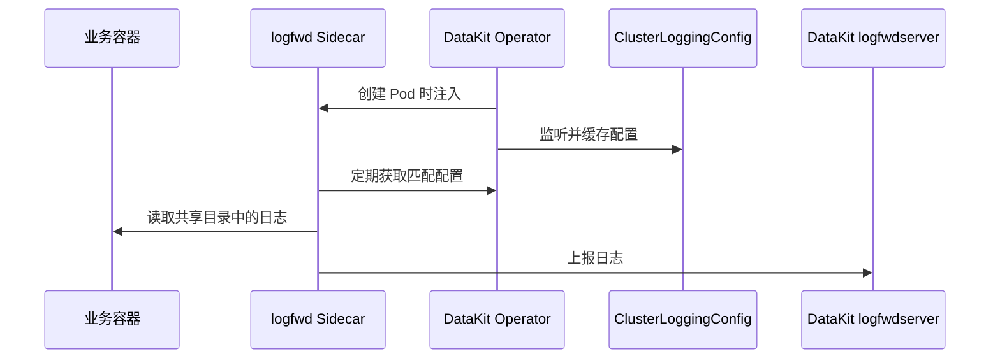

# DataKit Operator 注入 logfwd

logfwd 用于采集没有写入容器标准输出的文件日志。DataKit Operator 会在目标 Pod 中注入 `datakit-logfwd` Sidecar，并将业务容器的日志目录共享给 Sidecar；Sidecar 再把日志发送到 DataKit `logfwdserver`。

从 v1.7.0 开始，推荐使用 `ClusterLoggingConfig` CRD 集中管理采集配置。Sidecar 默认每 60 秒从 Operator 获取最新配置，更新采集规则时不需要重新创建业务 Pod。



## 前置条件 {#prerequisites}

- DataKit 已开启 `logfwdserver`，默认监听 `9533` 端口。
- DataKit Service 已开放 `9533`，应用 Pod 能访问 DataKit。
- 使用动态配置时，集群中已安装 `logging.datakits.io/v1alpha1 ClusterLoggingConfig` CRD，Operator ServiceAccount 具有 `get`、`list`、`watch` 权限。
- logfwd Sidecar 需要访问业务日志目录。该目录应使用共享 EmptyDir，或由 Operator 根据 `log_volume_paths` 创建并挂载。

旧版用法参见 [v1.6.0 及以前的 logfwd 注入](operator-v1.6.0-logfwd.md)。

## Operator 配置 {#datakit-operator-inject-logfwd-instructions}

在 `admission_inject_v2.logfwds` 中添加规则：

```json
{
    "admission_inject_v2": {
        "logfwds": [
            {
                "name": "logfwd-app",
                "namespace_selectors": ["^middleware$"],
                "label_selectors": ["app=logging"],
                "check_annotation": false,
                "image": "{{.LogfwdImage}}",
                "envs": {
                    "LOGFWD_DATAKIT_HOST": "{fieldRef:status.hostIP}",
                    "LOGFWD_DATAKIT_PORT": "9533",
                    "LOGFWD_DATAKIT_OPERATOR_ENDPOINT": "datakit-operator.datakit.svc:443",
                    "LOGFWD_GLOBAL_SERVICE": "{fieldRef:metadata.labels['app']}",
                    "LOGFWD_POD_NAME": "{fieldRef:metadata.name}",
                    "LOGFWD_POD_NAMESPACE": "{fieldRef:metadata.namespace}",
                    "LOGFWD_POD_IP": "{fieldRef:status.podIP}"
                },
                "log_configs": "",
                "log_volume_paths": ["/var/log/app"],
                "resources": {
                    "requests": {
                        "cpu": "100m",
                        "memory": "128Mi"
                    },
                    "limits": {
                        "cpu": "200m",
                        "memory": "256Mi"
                    }
                }
            }
        ]
    }
}
```

常用字段如下：

| 字段 | 说明 |
| --- | --- |
| `name` | 规则名称，用于日志定位，建议配置 |
| `namespace_selectors` | Namespace 正则数组 |
| `label_selectors` | Pod Label Selector 数组 |
| `check_annotation` | 旧版兼容开关；设为 `true` 时还要求 `admission.datakit/logfwd.instances` |
| `image` | logfwd Sidecar 镜像 |
| `envs` | Sidecar 环境变量 |
| `log_configs` | 可选的静态日志配置 JSON 字符串 |
| `log_volume_paths` | 需要在业务容器和 Sidecar 间共享的日志目录 |
| `resources` | Sidecar 资源配置；缺失或非法时使用默认值 |

Selector 和 Annotation 的通用规则参见 [DataKit Operator 注入规则](datakit-operator.md#datakit-operator-inject)。logfwd 使用第一条匹配规则。

### 环境变量 {#envs}

| 环境变量 | 说明 |
| --- | --- |
| `LOGFWD_DATAKIT_HOST` | DataKit 地址，通常使用节点 IP |
| `LOGFWD_DATAKIT_PORT` | DataKit `logfwdserver` 端口，默认 `9533` |
| `LOGFWD_DATAKIT_OPERATOR_ENDPOINT` | Operator 地址，用于动态获取 CRD 配置；省略协议时自动使用 `https://` |
| `LOGFWD_GLOBAL_SOURCE` | 覆盖所有日志配置的 `source` |
| `LOGFWD_GLOBAL_SERVICE` | 单条配置没有 `service` 时使用的全局值 |
| `LOGFWD_GLOBAL_STORAGE_INDEX` | 覆盖所有日志配置的 `storage_index` |
| `LOGFWD_GLOBAL_FROM_BEGINNING_THRESHOLD_SIZE` | 全局文件首部采集阈值，单位为字节 |
| `LOGFWD_POD_NAME` | 写入 `pod_name` 标签 |
| `LOGFWD_POD_NAMESPACE` | 写入 `namespace` 标签 |
| `LOGFWD_POD_IP` | 写入 `pod_ip` 标签 |

### 配置来源 {#log-configs}

logfwd 支持三种配置来源：

1. 推荐：通过 `LOGFWD_DATAKIT_OPERATOR_ENDPOINT` 动态获取 `ClusterLoggingConfig`。
1. 在规则的 `log_configs` 中配置静态任务。
1. 兼容旧版：通过 `admission.datakit/logfwd.instances` Annotation 配置。

`log_configs` 可以为空。只要规则匹配，Operator 仍会注入 Sidecar，使其能够从网络获取 CRD 配置。如果三种来源都没有提供有效配置，Sidecar 会被注入，但没有日志采集任务。

静态 `log_configs` 示例：

```json
[
    {
        "type": "file",
        "source": "app",
        "service": "checkout",
        "path": "/var/log/app/*.log",
        "multiline_match": "^\\d{4}-\\d{2}-\\d{2}",
        "from_beginning": false,
        "tags": {
            "env": "production"
        }
    }
]
```

该数组需要作为 JSON 字符串写入 Operator 配置中的 `log_configs`。常用字段包括 `type`、`source`、`path`、`service`、`pipeline`、`storage_index`、`multiline_match`、`from_beginning`、`from_beginning_threshold_size`、`character_encoding` 和 `tags`。

### 日志目录 {#volume-paths}

`log_volume_paths` 指定 Sidecar 需要读取的目录，例如：

```json
{
    "log_volume_paths": ["/var/log/app", "/data/log"]
}
```

- 如果业务容器已在该路径挂载 EmptyDir，Operator 会将同一个卷只读挂载到 Sidecar。
- 如果没有对应挂载，Operator 会创建 EmptyDir，并挂载到所有普通业务容器和 Sidecar。
- 如果同一路径使用的不是 EmptyDir，Operator 会记录冲突并跳过该路径。
- 避免同时配置父目录和子目录，以免产生挂载冲突。

动态 CRD 只能更新采集任务，不能修改已经创建的 Pod 卷。CRD 中新增文件路径前，应确保该目录已经通过 `log_volume_paths` 或业务 Pod 自身的 EmptyDir 共享给 Sidecar。

## ClusterLoggingConfig {#crd-config}

下面的资源匹配 `middleware` 命名空间中带有 `app=logging` 标签的 Pod：

```yaml
apiVersion: logging.datakits.io/v1alpha1
kind: ClusterLoggingConfig
metadata:
  name: app-logs
spec:
  selector:
    namespaceRegex: "^middleware$"
    podLabelSelector: "app=logging"
  podTargetLabels:
    - app
    - env
  configs:
    - type: file
      source: app
      service: checkout
      path: /var/log/app/*.log
      multiline_match: "^\\d{4}-\\d{2}-\\d{2}"
      tags:
        team: checkout
```

Operator 仓库不负责安装该 CRD。完整字段和 CRD 安装方式参见 [Kubernetes 容器日志 CRD 配置](../integrations/container-log-for-k8s-crd.md)。

## Deployment 示例 {#inject-logfwd-example}

```yaml
apiVersion: apps/v1
kind: Deployment
metadata:
  name: logging-demo
  namespace: middleware
spec:
  replicas: 1
  selector:
    matchLabels:
      app: logging
  template:
    metadata:
      labels:
        app: logging
      annotations:
        admission.datakit/logfwd.enabled: "true"
    spec:
      containers:
        - name: app
          image: nginx:1.25
          volumeMounts:
            - name: app-logs
              mountPath: /var/log/app
      volumes:
        - name: app-logs
          emptyDir: {}
```

创建后检查：

```shell
kubectl -n middleware get pod -l app=logging
kubectl -n middleware get pod -l app=logging -o yaml
kubectl logs -n datakit deployment/datakit-operator
```

Pod 应包含 `datakit-logfwd` Sidecar，并共享 `/var/log/app`。如果没有采集到日志，继续检查 DataKit `9533` 端口、`LOGFWD_DATAKIT_OPERATOR_ENDPOINT`、`ClusterLoggingConfig` 匹配结果和 Sidecar 日志。
